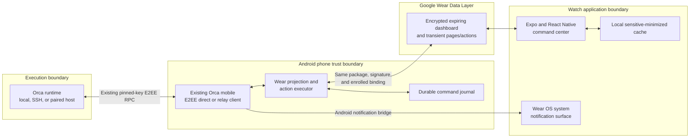
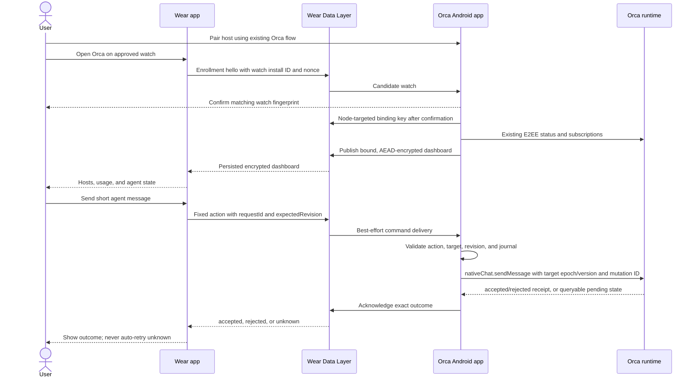
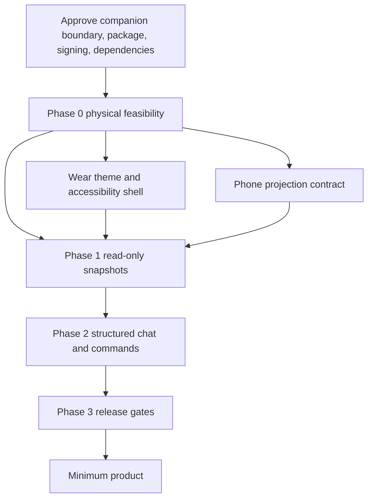

# Orca for Wear OS: command center plan

| Field              | Value                                                                                                                                             |
| ------------------ | ------------------------------------------------------------------------------------------------------------------------------------------------- |
| Status             | **Pending approval — architecture direction under active revision after on-disk prototype evidence; implementation not authorized**               |
| Calibration        | **standard** — an incumbent `wear/` prototype and Orca mobile's existing seams exist; this is reconciliation and gap-closing, not a from-scratch design |
| Provisional target | The user's Samsung Galaxy Watch, provisionally Wear OS 6 but possibly already upgraded to Wear OS 7 (Android 17/API 37 — see the evidence re-verification below for what is and isn't confirmed about its release status); exact model/build/OS version is confirmed by Phase 0 inspecting the physical device directly, not assumed from any online version claim |
| Minimum product    | Phone-assisted host pairing, account-usage visibility, agent status, structured message viewing/sending, and notification parity with Orca mobile |

## Decision summary

Build a dedicated Expo and React Native Wear OS application at the repository root, `wear/` — its own independent pnpm workspace, matching where the incumbent prototype already sits and keeping the whole portable phone-independent surface in one directory. Do not nest it inside `mobile/`: the root `pnpm-workspace.yaml` already declares `packages: []` specifically to keep `mobile/` out of the root package graph (its own comment states why — root's `patchedDependencies` conflict with auto-discovered nested workspaces), and reusing that same isolation for `wear/` avoids inventing a new root-tooling assumption. Keep its Expo, React Native, React, TypeScript, routing, test, formatting, and lint stack aligned with Orca mobile's through an automated version-parity check that reads both `mobile/package.json` and `wear/package.json` — two independently locked workspaces, not one shared lockfile, matching what already exists on disk today and reducing exactly one dependency-graph entanglement the eventual public-repository extraction would otherwise have to unwind. Share platform-neutral TypeScript contracts, projections, and design-token *values* (a parity contract enforced by a checked fixture test, not a cross-workspace import — see "Extraction-ready architecture" below); build watch-specific screens rather than shrinking phone layouts.

Kotlin remains only at the Android boundary that JavaScript cannot own safely: Wear Data Layer listeners, Keystore-backed binding crypto, background service/bootstrap, inbox admission, and rotary integration if React Native cannot meet the physical-device gate. The Expo config plugin owns generated manifests. This is a deliberate maintainability trade-off against Google's Compose recommendation. Expo and React Native do not document Wear OS as a separate first-class target, so Phase 0 must prove packaging, startup, navigation, input, accessibility, memory, and battery behavior on the actual watch before product work continues.

For the first release, keep the Android phone as the only client paired to each Orca runtime and exchange a deliberately narrow, versioned watch model over the Wear OS Data Layer.

The watch must not receive the phone's Orca device token, arbitrary RPC access, or a background WebSocket. It receives compact state snapshots and can submit only fixed, validated actions. The phone translates those actions onto the existing mobile RPC paths.

This is the recommended minimum because it:

- reuses Orca mobile's proven direct/relay E2EE, reconnect, replay, and mixed-version behavior;
- avoids granting the watch the current `mobile` scope, whose allowlist includes far more than command-center functions;
- uses the system's existing phone-to-watch notification bridge instead of creating duplicates;
- avoids a permanent watch radio connection and its battery cost;
- remains reversible: minimum runtime changes are additive, capability-gated workspace-routed native-chat read/subscribe, receipt-backed send, and post-auth mobile capability negotiation; existing clients keep their current paths and E2EE authentication frames.

A direct watch-to-runtime client is out of scope for this plan, not a later phase of it. The incumbent `wear/` prototype implements exactly that removed design — see the Phase 0 evidence re-verification below — and independent review confirmed it stores a real `mobile`-scope Orca device token on-watch and forwards arbitrary methods including `terminal.send`, `browser.*`, and `files.*` with no server-side Wear-specific allowlist (`src/main/runtime/runtime-rpc.ts` `MOBILE_RPC_METHOD_ALLOWLIST`; no `WEAR_RPC_METHOD_ALLOWLIST` exists anywhere in the runtime). That is precisely the authority-on-watch risk decision 1 exists to prevent, so this plan does not carry it forward as a conditional future phase; a direct client would be an entirely separate initiative requiring its own server-owned Wear grant, narrow allowlist, no-phone enrollment, Hermes/mobile crypto conformance, and push strategy, proposed and approved on its own merits rather than inherited from this document.

At fork-base source commit `4065d053cf942c1879379ebd8f1b50dda5568ff8`, `mobile/package.json` pins Expo `^55.0.27`, React Native `^0.83.9`, React `^19.2.6`, TypeScript `6.0.3`, Vitest `^4.1.9`, oxlint `^1.71.0`, and oxfmt `^0.52.0`; `mobile/app.json` enables the New Architecture. Implementation must copy the current mobile pins at branch time and keep them synchronized, rather than treating these plan-time versions as permanent.

### Approval decisions

Decisions 1 and 3-9 were previously accepted by Dhiman and stand. Decisions 2, 10, and 11 are revised or new as of the 2026-09-23 reconciliation below and are **not yet re-confirmed** — that is why the document header now reads "Pending approval" overall, even though most individual decisions below carry prior sign-off. Product implementation in Phases 0B-3 must not begin until every decision below, including 2/10/11, is explicitly accepted. Phase 0B is a separately authorized, isolated feasibility spike; it may exercise candidate dependencies and signing but cannot ship product behavior. Only artifacts explicitly classified as promotable-on-pass may enter Phase 1 after the required evidence rows close and normal review passes.

1. **Companion-first boundary:** the phone remains the paired Orca client for the minimum release. The watch can show cached state offline, but live state and commands depend on the phone's Orca connection.
2. **Independent-workspace stack (revised 2026-09-23; supersedes the earlier "shared mobile workspace" wording):** use a dedicated Expo/React Native app at root `wear/`, its own pnpm workspace (matching the incumbent prototype's location), version-parity-checked against `mobile/` rather than lockfile-shared with it. Do not port phone screen layouts or the terminal WebView. Keep Kotlin confined to the shared Expo Wear module and generated Android integration, living inside the portable `wear/` tree so it stays extraction-ready.
3. **Package and signing:** use `com.stably.orca.mobile` and ensure the installed phone and watch APKs have the same app-signing certificate. Internal builds may be APKs; Play delivery uses a Wear-enabled AAB on the dedicated Wear OS track. The Play upload key may differ from the app-signing key. (The incumbent `wear/` prototype uses `com.dhi13man.orcawear`, which cannot satisfy this decision without a package change — see the evidence re-verification above.)
4. **New dependencies:** the Wear app starts with the exact Expo/React Native/React/TypeScript versions already pinned by mobile, verified by an automated version-parity check across the two independent workspaces (decision 2). Approve Google Play Services Wearable and any watch-only navigation, rotary, or native dependency only after version, license, provenance, New Architecture, API-floor, and 64-bit/native-binary review. A dependency is not approved merely because a React Native wrapper exists.
5. **Notification scope — two different limits, not one:** minimum parity means system-bridged phone notifications plus an in-app watch event feed. Two distinct cases must not be conflated: (a) **honestly out of scope** — the phone is absent, the user has force-stopped Orca mobile, or no phone is paired at all; there is no mechanism that can reach the watch in these states, and the UI must say so plainly (unavailable, not silently stale). (b) **core required reliability, not excluded** — the phone app is merely backgrounded, screen-off, or reclaimed by ordinary Android Doze/process-management while never force-stopped; Android's `WearableListenerService`/Data Layer wake path is designed to survive exactly this, and the minimum release must prove it does, not assume it. Phase 0/1 must demonstrate the watch's own dashboard/attention state actually refreshes (not just that the OS-level system-notification bridge, a separate and already-reliable Android mechanism, keeps working) while the phone is background/screen-off/Doze. If that cannot be proved, this is a named Phase 0 feasibility-gate **failure** to report, not something covered by "the system notification bridge still works" — open-socket-only or notification-mirroring-only coverage does not satisfy this decision. Phone-absent or force-stopped killed-process push (case a) genuinely remains out of the minimum release.
6. **Hardware target:** confirm the exact watch model, Wear OS version, connectivity variant, and rotating-input behavior from Settings -> About before physical acceptance testing.
7. **Safe native-chat runtime change:** approve additive execution-host-routed native-chat read/subscribe plus receipt-reserved atomic send. The SSH portion includes a capability-gated relay handler, one-use primary-channel identity proof, connection-incarnation-scoped negotiation, and a stable cross-process send reservation/receipt store outside versioned relay installs. Existing reads cannot resolve SSH-host transcripts safely, and the existing React-owned mobile input lease/raw `terminal.send` cannot authorize a background watch send to the exact current agent.
8. **Android API floor:** require Wear OS 4/API 33 or newer on the watch and Android 12/API 31 or newer on the companion phone for the Wear feature. Android Keystore did not add ECDH key-agreement purpose until API 31, and there is no API 31 Wear OS release lane. Older phones may continue using Orca mobile but cannot enroll a watch. Do not add a weaker software-key compatibility path without separate approval.
9. **Windows SSH send boundary (interim state, not a release-completion waiver):** local Windows runtimes retain full command support. A Windows SSH relay advertises atomic send only if a no-directory-mutation receipt ledger passes forced crash/power-cut durability evidence; until that evidence exists, its conversations are read-only with an explicit unsupported/update-required state. That read-only state is **honest interim behavior while durability is unproven, not a satisfied "all paired machines" requirement** — "ALL paired machines and ALL agent types" (Product framing) supersedes treating it as an acceptable permanent release outcome. Before Phase 3 can call the minimum product done, either (a) the Windows-relay durability evidence is produced and atomic send is proved, or (b) Dhiman explicitly approves a scope reduction that excludes Windows SSH hosts from full "all machines" send parity for this release, recorded as its own decision, not silently inherited from this fallback. Adding a native Windows durability dependency, if needed to close (a), requires separate approval.
10. **No direct watch-to-runtime client (new 2026-09-23):** the direct-client architecture is out of scope for this plan entirely, not a conditional Phase 4. The incumbent `wear/` prototype already implements it and independent review found it holds full `mobile`-scope runtime authority on-watch (see the evidence re-verification above) — the exact risk decision 1 exists to prevent. A future direct-client initiative, if ever pursued, is a separate proposal on its own merits.
11. **Structured agent-session parity is in-scope starting Phase 0/1 (revised 2026-09-23 — two filters, not one, and messaging is a separate problem from inventory):** `session-tab-agent-status-projection.ts` applies two independent restrictions, not one: `structuredVisible` (line 20-23) hides every structured `agent-session` tab whenever `clientKind === 'mobile'`, full stop; separately, even a client that *does* see structured tabs (`clientKind === 'runtime'` with the capability declared, or `clientKind === undefined`) still has every `agent === 'codex'` structured tab filtered out (line 25-27). Reaching genuine "all agent types" requires resolving both, and inventory visibility alone is not messaging parity: structured sessions send through `StructuredAgentSessionOutbox` (`queued`/`dispatching`/`unconfirmed`, `delivery-unknown`/`failed` — `src/shared/structured-agent-session-outbox.ts`), a different state machine from native-chat's `accepted`/`rejected`/`unknown`, and reading them goes through `projectStructuredItemToNativeChat` (`src/shared/structured-agent-session-projection.ts`), not the raw PTY transcript path. Approve, as a bounded scope: (a) a capability-gated exception to the `mobile`-client-kind inventory filter so paired mobile-family clients can *see* structured tabs in the catalog, landing in Phase 1 as originally planned; and (b) a Phase 0 code-audit prerequisite, ahead of any implementation claim, to determine the exact transcript-read and send mapping from `StructuredAgentSessionOutbox`/`projectStructuredItemToNativeChat` onto the watch's action envelope — per supported agent kind (explicitly naming whether Codex structured sessions are covered or remain a further-named gap) and per host path (local/SSH/paired-runtime). Do not invent a new runtime endpoint and do not fall back to raw `terminal.send` for a structured session; if the audit finds no safe mapping for a given agent kind or host path by the time Phase 2 needs it, that combination is an explicit, named gap blocking full "all-agent" completion, not a silently narrowed claim. This is a runtime/mobile change that also affects Orca mobile's own phone screens, not a watch-only addition. Old, non-capability-declaring clients keep exactly today's compatibility behavior — nothing here changes what they see.

### Decision register

| Decision                                                                         | Owner                                | Evidence required before product code                                                             | State                             |
| -------------------------------------------------------------------------------- | ------------------------------------ | ------------------------------------------------------------------------------------------------- | --------------------------------- |
| Companion-first minimum, notification scope, and safe native-chat runtime change | Dhiman                               | Approval of decisions 1, 5, and 7                                                                 | Approved                          |
| Independent-workspace Expo/React Native stack (revised)                          | Dhiman and Orca implementation owner | Re-confirmation of revised decision 2; physical Expo-on-Wear feasibility plus exact dependency review | Open — direction revised 2026-09-23 |
| Package, signing, version-code, and Play topology                                | Android release owner                | Installed-APK certificate fingerprints and Play signing/export evidence                           | Open                              |
| Watch enrollment, payload, retention, and disclosures                            | Orca security/privacy reviewer       | Threat-model and final-schema review                                                              | Open                              |
| Physical device/API support, Wear API 33 floor, and phone API 31 floor           | Dhiman and Orca implementation owner | Approval of decisions 6 and 8; on-device Settings/ADB and Google Play Services evidence           | Open                              |
| Windows SSH atomic-send capability                                               | Dhiman and Orca runtime reviewer     | Approval of revised decision 9; Windows crash/power-cut durability evidence proving atomic send, **or** Dhiman's explicit approval of a named "all machines" scope reduction excluding Windows SSH hosts — status-only is not itself a closing state | Open — reopened 2026-09-23 pending durability proof or scope-reduction decision |
| No direct watch-to-runtime client                                                | Dhiman                               | Approval of new decision 10                                                                        | Open — new 2026-09-23              |
| Structured agent-session inventory + messaging parity                            | Dhiman and Orca implementation owner | Approval of revised decision 11; Phase 0 code audit of the real `StructuredAgentSessionOutbox`/transcript mapping per agent kind and host path, before any Phase 2 completion claim | Open — revised 2026-09-23, audit not yet performed |

Phase 0A gathers no-code/read-only evidence and records preliminary choices. Dhiman then explicitly authorizes or rejects the isolated Phase 0B spike. Phase 0B updates this register with the named assignee and final evidence links. No calendar deadline is invented; each row is a hard prerequisite for the phase that consumes it.

### Evidence re-verification — 2026-09-23

This pass re-read the repository at branch `Dhi13man/ship-orca-wearos`, HEAD `b48130a57a774653fe19ffc14c5885632e9e61e6`, re-ran the primary-source research this plan depends on, and incorporated an independent read-only reviewer's findings (adjudicated below; no code was built, tested, or modified by either pass).

**1. An untracked prototype at root `wear/` is a working implementation of this plan's rejected direct-client design, holding real mobile-scope runtime authority — not a partial start on the approved companion architecture.** `wear/` is a second, independent Expo app with its own `pnpm-workspace.yaml`/`pnpm-lock.yaml`. Concrete, file:line-grounded findings:

   - **It holds the phone's exact authority, not a narrower watch grant.** `wear/src/orca/pairing.ts:7-14` accepts an Orca pairing code carrying `scope: 'mobile' | 'runtime'` — the same code minted for the real phone app — and `wear/App.tsx:38` only rejects `scope === 'runtime'`; a `mobile`-scope code is accepted, persisted in `expo-secure-store` (`wear/src/orca/pairing-store.ts:9-29`), and presented on every request as `client: { id: pairedDeviceId, type: 'mobile' }` (`wear/src/orca/direct-orca-client.ts:125`). `MOBILE_RPC_METHOD_ALLOWLIST` in `src/main/runtime/runtime-rpc.ts` includes `browser.*`, `files.*`, `clipboard.*`, `accounts.*` mutation, and `terminal.send`; no `WEAR_RPC_METHOD_ALLOWLIST` exists anywhere in the runtime to narrow this. This is a code-path finding about what the app is built to do, not a claim that a live credential is sitting on a paired watch right now — no device was inspected and no token contents were read.
   - **A from-scratch E2EE reimplementation, not reuse.** `wear/src/orca/e2ee.ts` reimplements Orca's E2EE v2 handshake with `tweetnacl` independently of the mobile app's crypto module; byte-level parity against the real runtime's server-side handshake was not verified by either pass.
   - **A raw `terminal.send` sender**, not the plan's fenced/fixed `sendAgentMessage` action (`wear/src/orca/direct-orca-client.ts:105-143`) — the same unsafe fallback the plan's Phase 2 design exists to avoid.
   - **Wrong package/signing identity.** `wear/app.json:18` sets `"package": "com.dhi13man.orcawear"`, not the approved `com.stably.orca.mobile` (confirmed at `mobile/android/app/build.gradle:98,100`). `AndroidManifest.xml` additionally sets `standalone=true` and `usesCleartextTraffic=true`, both inconsistent with the approved companion build contract; note that cleartext transport does not by itself mean the application-layer E2EE payload is exposed in plaintext, only that the outer channel offers weaker protections (e.g., no TLS-level authentication) than the plan's model assumes.
   - **A forked, non-parity design-token set.** `wear/src/wear-theme.ts` defines its own `wearColors` palette. One value (`secondary`/`muted: '#a1a1a1'`) does happen to match `mobile/src/theme/mobile-theme.ts`'s `textSecondary`/`textMuted` — so this is not a zero-overlap fork — but the palette is not derived from or checked against `mobile-theme.ts`, and most values (`background: '#0a0a0a'` vs. `bgBase: '#111111'`, etc.) diverge; spacing/radii/typography scales are inlined per-file rather than shared at all.
   - **Single-host, local-execution-only scope.** `PairingOffer` encodes one `endpoint`; there is no host catalog. `direct-orca-client.ts:74-76` and `agent-conversation.tsx:30-31` gate read/send on `agent.execution === 'local'`, so SSH/paired-runtime/folder-workspace agents are permanently disabled in the UI. This is real code evidence that the scaffold does not attempt "all agents on all paired machines" — it is additional grounding for, not a substitute for, this plan's own product framing below.
   - **No nudge path.** No notification listener, headless task, WorkManager, or Data Layer client anywhere in the tree; agent state updates only on manual pull-to-refresh.
   - **A hand-rolled local/remote classifier** (`runtime-dashboard.ts:83-91`, inferring `local`/`remote`/`unverifiable` from whether `connectionId` is null or `wsl:`-prefixed) duplicates logic this plan assigns to `worktree.ps`/`WorktreeCatalogSnapshotClient`/`session.tabs.subscribeAll` instead of reusing it — a live risk if the heuristic ever diverges from the canonical classifier on an edge case, per AGENTS.md's reuse-before-reimplementing rule.

   This worker (and the independent reviewer) did not modify, delete, or otherwise touch `wear/`, and this plan does not require it to be discarded — that decision belongs to Dhiman (decision register above), not to this document. This plan's rejection is scoped to `wear/`'s **authority and transport paths**: the direct-to-runtime pairing/E2EE/RPC stack (`wear/src/orca/*`) and its build/package identity are not reused, full stop. That rejection does not extend to `wear/`'s presentation layer. Genuinely reusable, evaluable UI mechanics observed in the code — the pairing-code UX pattern, an accepted/rejected/unknown send vocabulary that correctly avoids auto-retry on ambiguity, a round-screen-aware inset calculation, `WearButton`'s 48×48dp-floor layout, and error/empty-state structure — are candidates worth evaluating for reuse in `wear/`'s Phase 1+ screens once the underlying data/transport is replaced with the approved companion architecture; nothing here mandates porting them either, only that they not be dismissed sight-unseen as "different by construction" when the construction in question is layout and button styling, not authority or transport. Evaluate and port what holds up during Phase 1 UI work; do not rewrite proven presentation code for its own sake.

**2. The plan's earlier "Wear OS 7 is now GA" claim did not hold up under a second, direct re-fetch and is withdrawn.** A prior pass of this reconciliation cited `developer.android.com/training/wearables/versions/7/changes` for both an exact "2026-06-16" ship date and a "general availability" status; a direct re-fetch of that same page confirms it states the Android 17/API 37 mapping but contains no date and no general-availability wording at all — neither claim is supported by the cited source, and both are removed rather than partially kept. What remains, grounded only in what the page actually says: Wear OS 7 corresponds to Android 17/API level 37. Its release/preview status and the exact watch's actual installed OS are unverified by this document; Phase 0 must read the real value from the physical device rather than from any online claim, dated, GA-labeled, or otherwise. This does not change the approved API 33 floor (decision 8 still stands as the minimum).

| Decision                                                    | Owner  | Evidence required before product code                                                                  | State |
| ------------------------------------------------------------ | ------ | ---------------------------------------------------------------------------------------------------------- | ----- |
| Reconcile or discard the untracked `wear/` direct-client prototype | Dhiman | Explicit choice: archive outside the repo, delete, or scope as its own separately approved initiative, never folded into this plan's Phases 0-3 | Open  |

Whatever Dhiman decides for `wear/`, if any build from it was ever installed on a physical watch and paired against a real Orca runtime — this worker did not check whether that happened — that pairing used a `mobile`-scope device token indistinguishable, at the runtime's authorization layer, from a real phone (see finding 1 above). Before treating that possibility as closed: confirm on the runtime side whether any `mobile`-scope device token was ever issued to a non-Orca-mobile client and, if one was, revoke it through the existing device-registry removal path — the same mechanism that already retires a lost or replaced phone. This is a revocation-hygiene check, not a code change, and it is independent of whichever resolution the decision-register row above lands on.

## Goals

### Product framing

The watch answers three questions without pulling out the phone: **who needs me, what are they doing, and can I unblock them?** That is a phone-companion job-to-be-done, not a mini Android app — it is scoped to attention (which host/agent needs the user), agent state (what every paired host's agents are doing), usage (is a provider about to rate-limit), and a fast phone handoff (send a short reply, or escalate to the phone for anything larger). Every screen in "Product and interaction design" below maps to one of those four jobs; a feature that does not serves the phone app, not the watch.

"ALL paired machines and ALL agent types" is a scope commitment, not an aspiration: every host the user has paired with Orca belongs in the watch's catalog with no subset, and both terminal-backed and structured agent sessions belong in the watch's agent inventory. Two clarifications keep this bounded rather than unbounded, matching "complete discovery is not unbounded subscriptions or scrolling transcripts" — neither is a coverage exclusion:

- **Host catalog completeness vs. live-connection concurrency are different things.** Every paired host is always visible with its cached/stale state. Only a bounded number hold a concurrently *live* socket at once — a background-concurrency policy sized from Phase 0's radio/battery evidence and the on-screen host's own slot, never a fixed number chosen in advance and never a reason a host is missing from the catalog (see Phase 1 below).
- **Structured agent-session parity is bounded and in-scope, not a deferral — but inventory visibility and messaging are two separate problems.** `session-tab-agent-status-projection.ts` hard-filters structured `agent-session` tabs out of every `session.tabs.subscribeAll`/`listAll` payload whenever `clientKind === 'mobile'`, and separately filters out every Codex structured tab even for clients that do see structured tabs — before any Wear-specific code runs, and Orca mobile's own phone screens cannot see them today either. Lifting the first filter (Phase 1, decision 11) makes structured agents *visible* in the catalog; it does not by itself give the watch a way to read or send messages for them, because structured sessions use a different outbox/state model (`StructuredAgentSessionOutbox`) than the terminal-backed native-chat path this plan's messaging design is built around. Reaching complete "all agent types" — inventory and messaging together, for every agent kind including Codex — requires the Phase 0 code-audit and Phase 2 per-agent-kind/per-host-path acceptance named in decision 11; until that audit closes, treat structured-session messaging coverage as a named open gap, not an assumed extension of the terminal-backed design below.
- **Usage is deduplicated by provider account, not by host count.** The same Claude or Codex account can be paired on multiple hosts; the dashboard and per-host usage screens present one true figure per provider account (see the `wear.dashboard.v1` and `accountUsage` design in "Phone/watch contract"), never N potentially-conflicting copies that could each claim a different remaining-quota number for the same account.

- Pair the watch with Orca's Android companion and discover every one of the phone's paired Orca hosts without rescanning every desktop code.
- Show deduplicated, per-provider-account Claude and Codex usage with the same session/weekly/reset semantics and last-updated honesty as mobile, not a per-host copy that can disagree with itself.
- Catalog every paired host and show live/cached terminal-backed *and* structured agent sessions that the mobile runtime projects across local, SSH, and paired-runtime hosts, including folder workspaces and Git worktrees.
- Open a selected agent's recent conversation and send a short typed or dictated message through the atomic host method, with a real end-to-end reply round trip — not a stub that only renders a local echo. Terminal-backed agents use the native-chat path this plan specifies in full; structured agents get the same catalog visibility starting Phase 1, with messaging following per agent-kind/host path only as the Phase 0 code-audit and Phase 2 acceptance in decision 11 prove each one safe — not assumed complete on the same schedule as terminal-backed messaging.
- Preserve Orca's mutation outcome vocabulary: `accepted`, `rejected`, or `unknown`; never silently retry an ambiguous send.
- Surface Orca notifications on the watch without duplicates and provide replay-backed recent events in the app, driven by an actual push/refresh mechanism rather than manual pull-to-refresh only.
- Remain glanceable, round-screen safe, rotary-operable, TalkBack-readable, and explicit about stale/unverifiable state.

## Non-goals for the minimum release

- Full terminal rendering or raw terminal input.
- Browser control, file editing, source-control actions, PR review, account switching, workspace creation/removal, or SSH setup.
- Internal `orchestration.*` mailbox access. User messages use the native-chat surface and its dedicated safe-send method.
- Image/audio attachments, raw microphone streaming, or long-form transcript browsing.
- A direct runtime credential on the watch, and a direct watch-to-runtime client of any kind (see "Decision summary" above — this is out of scope, not a conditional later phase).
- Phone-absent real-time notifications, FCM/relay push infrastructure, complications, or Wear OS 7/API 37-specific surfaces beyond the approved API 33 floor (its release/preview status is unverified — see the evidence re-verification above — but it is out of scope for the minimum release either way, which targets API 33+).
- Manual edits under generated `mobile/android` or `wear/android`; Expo prebuild would erase them.

## Current Orca architecture

### Existing reusable seams

| Need                              | Existing source of truth                                                                    | Planned watch projection                                                                                     |
| --------------------------------- | ------------------------------------------------------------------------------------------- | ------------------------------------------------------------------------------------------------------------ |
| Host connection and compatibility | `mobile/src/transport/host-logical-client.ts`, `status.get`, mobile direct/relay transport  | Phone publishes compatible/unavailable state; watch never handles runtime credentials in the minimum release |
| Account usage                     | `accounts.subscribe` and `accounts.list`; `mobile/src/components/account-usage-state.ts`    | Per-host provider usage, reset labels, and generated-at timestamp                                            |
| Agent inventory                   | `session.tabs.subscribeAll`, with `session.tabs.listAll` fallback                           | Compact host/workspace/agent rows; preserve authoritative vs incomplete inventory semantics                  |
| Conversation view                 | Existing local `nativeChat.*` plus new capability-gated workspace-routed read/subscribe     | Recent local/SSH messages; execution host owns transcript access; subscribe only while the view is open      |
| Message send                      | Existing ambiguity/lease/PTY primitives plus new `nativeChat.sendMessage` and receipt query | Fixed `sendAgentMessage` action returning accepted/rejected/unknown without raw `terminal.send` fallback     |
| Notifications                     | `notifications.subscribe`, `notifications.getMissedSince`, mobile watermark/dedupe logic    | System-bridged notification plus a bounded in-app event projection                                           |
| Remote semantics                  | `docs/reference/ssh-execution-boundary.md`                                                  | Host owns execution; disconnect means `unverifiable`, never inferred `exited`                                |
| Mixed versions                    | `src/shared/protocol-version.ts`, `docs/reference/remote-wire-compatibility.md`             | Versioned phone/watch contract and explicit capability fallback                                              |

The runtime currently has only `mobile` and `runtime` device scopes. `MOBILE_RPC_METHOD_ALLOWLIST` in `src/main/runtime/runtime-rpc.ts` includes account mutation, files, Git, browser control, settings, terminals, and workspace mutation. Hiding those controls in the watch UI would not remove their authority. This is why the minimum design keeps the runtime credential on the phone.

The user-facing message path is not the internal orchestration mailbox. Agent discovery comes from `session.tabs.subscribeAll`. Existing native-chat transcript resolution is local/WSL and cannot silently serve SSH workspaces, so the watch path adds execution-host-routed read/subscribe capability that accepts opaque workspace/session identity and fails closed when the SSH host is unreachable. Sending adds capability-gated `nativeChat.sendMessage` because mobile's current composer safety depends on a React-owned input lease and the host rejects a combined guarded `terminal.send` body-plus-submit. Local sends use the main runtime's existing settled-prompt writer and local durable receipt. For SSH, the relay first durably reserves the mutation; only a proved reservation lets the main runtime revalidate the exact published session and invoke its existing settled-prompt state machine through the remote PTY provider. The relay then records the outcome. Any ambiguous begin/write/complete boundary stays pending/`unknown` and is never resent. Old hosts or relays expose status but no unsafe chat fallback.

### Minimum architecture



The watch (`C`) has no edge to the runtime (`R`) in this diagram, direct or optional. Decision 10 rejects the direct watch-to-runtime client entirely; there is no later-phase path for this plan to leave a dotted line toward.

### Pairing and command sequence



## Phone/watch contract

The Data Layer contract is not a tunnel for raw Orca RPC. It is a separate, smallest-useful surface owned by the mobile companion.

### Extraction-ready architecture

`wear-companion-contract` and `expo-wear-data-layer` (below) are colocated inside this Orca checkout only so the feature can be built against the real mobile/backend stack it depends on; colocation is a workspace-management convenience, not evidence of a decision to publish. If a personal public OSS repository is considered later, it applies only after this plan is fully implemented, reviewed, and Dhiman is satisfied with it — and only after a separate license/provenance/asset audit and explicit approval, none of which this document performs or brings closer. Publication, license selection, and branding/package renaming all wait for that future, explicit user decision.

The boundary this plan actually holds today:

- **Everything portable lives inside `wear/`.** The watch app, its native Data Layer transport (`wear/packages/expo-wear-data-layer`), and the public product contract (`wear/packages/wear-companion-contract`) are all under one directory, importing no React, Expo, Node, or desktop-runtime code from outside it.
- **The Orca-specific adapter stays in `mobile/`.** Everything that knows about Orca's runtime RPC, device registry, or account/session model — the phone-side projection, publication, and command-executor code under `mobile/src/wear/` — lives in `mobile/`, which depends inward on `wear/`'s contract package. `wear/` never imports from `mobile/` or any other desktop-only tree; the dependency edge points one way only.
- **A standalone `wear/` build requires nothing from `mobile/`.** `wear/`'s own install, typecheck, lint, test, and prebuild run from a clean checkout of `wear/` alone (plus its own `packages/` members) — no build step reaches into `mobile/`, the repository root, or any sibling directory, and no fixture references a private credential.
- **The extraction smoke test is exactly that claim, executed.** Copy only `wear/` (and nothing else) into an empty temporary tree, `pnpm install && pnpm build && pnpm test` from there with no sibling directories present, and require it to succeed using only its own committed public fixtures. This is a Phase 0/3 verification item, not aspirational text — if the copy-and-build fails, the boundary above is not actually true yet.

An extracted `wear/` repository passing that smoke test is still not, on its own, a working product: Google Data Layer requires the watch and its paired phone app to share an application ID and installed signing certificate (decision 3), so a plucked-out watch codebase cannot interoperate with an arbitrary Orca phone install unless a compatible signed phone counterpart is published and maintained alongside it — extraction is a two-sided distribution problem, not just a source-code boundary. This plan does not solve that now; it deliberately avoids building a generic multi-backend transport framework for a hypothetical future consumer, keeping one small versioned phone/watch contract and one Orca-specific adapter. Whenever extraction is actually pursued, it needs its own decisions for shipping-artifact/phone-bridge ownership, coordinated application-ID/signing configuration (no keys ever committed to either repository), and a reproducible paired-build smoke test proving the extracted watch app and its phone counterpart still interoperate after the split — named here as a future prerequisite, not undertaken by this document.

| Contract concern                                                                                          | Single owner                                                                             |
| --------------------------------------------------------------------------------------------------------- | ---------------------------------------------------------------------------------------- |
| Action/product schema, projections, canonicalization, and public TypeScript API                           | The language-neutral manifest and generated TypeScript in `wear-companion-contract`      |
| Generated phone/watch manifests and role-specific services/features                                       | The `expo-wear-data-layer` config plugin                                                 |
| Data Layer calls, Keystore crypto, service lifecycle, native inbox, and reject-before-JS action admission | Kotlin in `expo-wear-data-layer`, with admission code generated from the shared manifest |
| Phone execution, watch state, and React Native UI                                                         | TypeScript in the consuming Expo app; shared packages contain no app/runtime imports     |

### Companion binding

Before any snapshot or action, the phone and watch complete `wear.binding.v1`:

```text
wear.binding.v1 = {
  schemaVersion,
  bindingId,
  phoneInstallId,
  watchInstallId,
  phoneNodeId,
  watchNodeId,
  issuedAt
}
```

- The phone and watch each generate a stable random install ID and a fresh, non-exportable P-256 ECDH enrollment keypair in Android Keystore. Data Layer node IDs are transport observations, not durable authorization.
- The enrollment hello carries the one-time public key and nonce. The user confirms a short fingerprint derived from both install IDs, public keys, and nonces on both screens. The phone then creates a random binding ID and 256-bit binding key.
- After confirmation, the native modules derive a bootstrap key with ECDH plus HKDF-SHA-256, wrap the binding key with AES-GCM, and send it only to the selected node with `MessageClient`. Each side stores the binding key under a device-local non-exportable Android Keystore wrapping key, deletes the one-time ECDH key, and never exposes raw key material to JavaScript.
- Native modules protect every envelope with AES-256-GCM. The binding ID, schema version, path, publisher epoch, revision/request ID, and expiry are authenticated additional data; nonces are unique per binding/key. Data Item paths are namespaced as `/orca/wear/v1/{bindingId}/...`, but paths are routing—not confidentiality.
- Persistent Data Items contain ciphertext only and are readable only after successful bound-key decryption. Commands/read pages use node-targeted `MessageClient` and the same AEAD envelope.
- Node change, app reinstall, or phone replacement requires explicit rebind. Binding removal durably records `removalDeadlineAt = now + 24 hours`, marks the binding revoked, rejects its commands, stops publication, publishes an AEAD-protected tombstone, and immediately deletes every non-tombstone phone-owned Data Item for that binding.
- The phone retains only the tombstone, wrapped binding key, and metadata-only revocation record until the watch acknowledges removal or `removalDeadlineAt` passes. Either terminal event deletes the tombstone, remaining Data Items, native inbox rows/counters, key, and binding record. Cleanup runs on acknowledgement, the deadline worker, and startup/service-entry reconciliation; a powered-off phone performs overdue cleanup before any later publication. A watch that misses the tombstone cannot resume the revoked binding: its cached dashboard expires within 24 hours, later traffic is rejected as an unknown binding, and the UI requires re-enrollment.
- Multiple-phone and multiple-watch tests prove that snapshots and commands cannot cross bindings even though the apps share package/signing identity.

### Persistent dashboard envelope

```text
wear.dashboard.v1 = {
  schemaVersion,
  bindingId,
  publisherEpoch,
  revision,
  generatedAt,
  expiresAt,
  companionState,
  hostPage: { total, included, truncated, nextCursor },
  hosts: [{
    hostId,
    displayName,
    connectionState,
    inventoryAuthority,
    accountUsage: {
      claude: wear.providerUsage.v1 | null,
      codex: wear.providerUsage.v1 | null
    },
    agentCounts: { total, working, needsAttention },
    lastActivityAt
  }]
}
```

`accountUsage` is a closed, persisted projection rather than an `AccountsSnapshot` copy:

```text
wear.providerUsage.v1 = {
  status: "idle" | "fetching" | "ok" | "error" | "unavailable",
  session: wear.usageWindow.v1 | null,
  weekly: wear.usageWindow.v1 | null,
  updatedAt
}

wear.usageWindow.v1 = {
  usedPercent,
  windowMinutes,
  resetsAt
}
```

Rules:

- IDs are opaque host-issued values. The watch never constructs paths or infers Git support.
- The phone maps only the declared active-provider rate-limit fields into `accountUsage`; it never spreads or serializes `AccountsSnapshot`. `wear.providerUsage.v1` and `wear.usageWindow.v1` are frozen, closed security sub-schemas whose generated decoders reject unknown fields. Adding a usage field requires a new capability-negotiated schema version/path rather than an optional v1 extension. Fixtures containing account IDs, email addresses, organization/workspace identifiers, runtime targets, inactive-account lists, reset-credit details, or free-form error/reset descriptions must fail.
- Dashboard content excludes device tokens, relay credentials, account identifiers, workspace/session IDs, workspace/agent names, notification content, file paths, raw terminal output, and transcripts.
- `inventoryAuthority` distinguishes an authoritative empty inventory from an incomplete/old-host result.
- The serialized ciphertext envelope is capped at 32 KiB, well below Data Layer's 100 KB hard limit. Hosts sort by connected/most-recent state with opaque ID tie-breakers. Every clipped collection reports `total`, `included`, `truncated`, and `nextCursor`; clipping is never presented as a complete inventory.
- Every screen shows the relevant generated-at time when state is not live.
- Loss of contact maps to `unverifiable`; it does not become `exited`, `done`, or any synonym.
- The phone overwrites one dashboard item per binding, deletes superseded/expired items, and includes a 24-hour expiry that the watch enforces even while offline. The watch persists only the decrypted sensitive-minimized dashboard in app-private no-backup storage. Agent pages, inbox pages, and chat content are never placed in a persistent Data Item, DataStore, or Tile.

### Transient detail envelope

```text
wear.detailPage.v1 = {
  schemaVersion,
  bindingId,
  requestId,
  publisherEpoch,
  revision,
  generatedAt,
  expiresAt,
  pageType,
  page: { total, included, nextCursor },
  items
}
```

`pageType` is initially `hostCatalog`, `hostAgents`, or `notificationInbox`. Host-agent items carry their exact opaque `workspaceId`, `workspaceKind`, `sessionTabId`, runtime `publicationEpoch`, and `snapshotVersion`; those fences are per workspace, never one pair per host. Responses are AEAD-protected, node-targeted `MessageClient` messages, capped at 32 KiB, held only in watch memory, and discarded on navigation, expiry, process death, binding change, or node loss. Needs-attention agents sort first, then live/most-recent activity, with opaque ID tie-breakers. Notification pages contain redacted session catch-up entries only.

### Action envelope

```text
wear.action.v1 = {
  schemaVersion,
  bindingId,
  requestId,
  expiresAt,
  action,
  target,
  publisherEpoch,
  expectedRevision,
  targetPublicationEpoch,
  targetSnapshotVersion,
  payload
}
```

The initial action enum is limited to:

- `readHostPage`: request another transient dashboard-compatible host page;
- `readHostAgents`: request one transient, paged agent list for a current host;
- `readNotificationsPage`: request one transient, redacted session-catch-up page;
- `openConversation`: request a recent structured-chat projection for one current session;
- `renewConversation`: extend the exact current conversation lease while its screen remains visible;
- `closeConversation`: stop that projection and clear transient content;
- `sendAgentMessage`: send one short text message to the exact current session;
- `requestPhoneHandoff`: ask the phone to open the exact current host/workspace/agent locally, via a phone-local notification deep link, for anything the watch itself can't or shouldn't do (see "Phone handoff" above);
- `refresh`: ask the phone to refresh its existing subscriptions.

No envelope may contain an arbitrary RPC method, and every action has a closed payload schema that rejects unknown fields. A language-neutral action manifest in `wear-companion-contract` is the sole authority for action discriminants, fields, limits, and canonicalization order; generation produces the TypeScript decoder and the narrow Kotlin admission validator used before JavaScript wakes. Every read request carries binding ID, publisher epoch, revision, collection/host identity, and opaque cursor; unavailable, stale, expired, and end-of-page are distinct retry-safe results. For mutation actions, the phone additionally validates the exact target workspace's runtime publication epoch and snapshot version. The journal key is `(bindingId, requestId)` and contains a canonical action hash, immutable target fences, state, and result—not message text. It rejects same-ID/different-input reuse, replays the same receipt for same-ID/same-input, and marks pending before host I/O. The host mutation ID is binding-namespaced. Local receipts live in the main runtime; SSH reservations/receipts live on the relay and are queried through the main runtime. Missing acknowledgement remains `unknown`, not a resend.

Admission limits are fixed contract constants, not user configuration: an encrypted action is at most 8 KiB, decoded `payload` is at most 4 KiB, every opaque ID/cursor is at most 256 UTF-8 bytes, and `sendAgentMessage` text is nonblank and at most 2 KiB UTF-8. One action executes per binding and one headless host-client acquisition executes process-wide. The native listener keeps at most eight pending entries per binding within the 64-entry global inbox, admits at most 30 read/lease actions per rolling minute with burst four, admits at most 10 sends per rolling minute with a two-second minimum gap, admits one refresh per ten seconds, and admits at most one `requestPhoneHandoff` per five seconds so a stuck watch screen cannot spam the phone with duplicate notifications. It authenticates, decrypts, checks schema/binding/expiry/size/rate/concurrency, and returns an encrypted `rejected` reason before waking JavaScript when a limit fails. Native coarse-window state prevents a JS restart from resetting admission. TypeScript, Kotlin, and runtime fixtures must prove byte-identical UTF-8 counting and boundary behavior; the runtime independently enforces the message ceiling.

The native action inbox uses an explicit crash-safe lifecycle: insert `pending`, atomically claim with a short claim deadline, let JS durably record the same hash/fences, then delete the ciphertext only after JS confirms journal handoff. A crash before the JS journal expires/requeues the claim only while the action itself remains valid; a crash after the journal write dedupes through that journal and deletes the native row without another host mutation. Native rejection is never inserted. Startup/service-entry GC deletes expired rows, successful handoff deletes claimed rows, and binding removal/uninstall clears the binding's rows and counters. These transitions are tested at every boundary so encrypted prompt text cannot linger or exhaust capacity.

Conversation capacity is also fixed: one active conversation lease per binding, four total in the phone process, and four per execution host or relay process. Opening another conversation for the same binding must cancel and receive teardown acknowledgement for the old lease before replacement; an unverified cancellation or a full process/host budget returns `rejected: busy` and creates no stream. Each remote lease is keyed to the authenticated phone, binding, publisher epoch, and lease ID and hard-expires no later than 120 seconds after its last valid renewal. While the phone process is alive, close, node loss, binding removal, and reconnect each attempt acknowledged remote cancellation. Before opening, the phone persists one closed cleanup record containing only `{ bindingId, phonePublisherEpoch, hostId, leaseId, expiresAt }`; it contains no workspace, session, agent, or transcript identity and is capped by the four-lease phone limit. On the next authenticated connection, restart reconciliation asks each reachable execution host/relay to cancel stale owner epochs and waits for acknowledgement before replacement; unreachable cleanup remains `rejected: busy` until server expiry. Cancellation acknowledgement or hard expiry deletes the record, and startup GC removes expired records. Process death cannot send a teardown callback, and restart cleanup never extends the original deadline.

## Product and interaction design

### Navigation

Three top-level screens, matching "who needs me, what are they doing, can I unblock them" directly rather than a generic dashboard-plus-drilldown shape:

1. **Attention (default screen):** companion state, stale timestamp, and every needs-attention agent ranked across every paired host — this also carries the redacted, session-scoped Orca event feed (the former standalone "Inbox"); selecting an event or agent opens the exact host/workspace when valid and selects an agent only when current inventory proves a unique match.
2. **Agents:** the full host catalog; selecting a host opens its agent list, and selecting an agent opens its detail route.
3. **Usage:** deduplicated, per-provider-account Claude/Codex usage across every paired host (see "Usage is deduplicated by provider account" above) — its own top-level screen, not folded under a per-host view, because "is a provider about to rate-limit" is a standalone job, not something the user should have to already be inside a specific host to check.

Detail routes, reached from Attention or Agents, not top-level themselves:

4. **Host:** account usage and agents for one host.
5. **Agent:** concise state and recent structured messages.
6. **Compose message:** system keyboard and system speech-to-text for a short message.
7. **Phone handoff:** an explicit action available from the Agent and Compose routes, not a screen of its own — see "Phone handoff" below.

Offline mode shows the encrypted dashboard's host/usage/count summary only. Agent identities, event rows, and conversations require the enrolled phone node to answer a transient read; the UI says "Phone unavailable" rather than presenting retained sensitive detail as current.

#### Phone handoff

"A fast phone handoff... escalate to the phone for anything larger" (Product framing) needs an actual mechanism, not just a product statement — it was missing from the action enum below. `requestPhoneHandoff` is a new fixed action, fenced to the exact current target (host/workspace/session identity, `targetPublicationEpoch`, `targetSnapshotVersion` — the same target fencing every other target-bound action already uses) so it can never open the wrong agent on the phone. On receipt, the phone's action executor does not attempt to silently foreground Orca mobile — Android does not generally allow a background process to bring another app's activity to the foreground without a user gesture. Instead it posts a phone-local, high-priority system notification (from the already-running phone process, not a new push mechanism) carrying a deep link that opens Orca mobile directly to that exact host/workspace/agent when tapped. Acceptance: a `requestPhoneHandoff` action against a live target produces exactly one phone-local notification, opening the exact target on tap, within a bounded latency budget set in Phase 0; a stale/superseded target is rejected the same way every other target-fenced action is, and the watch shows the outcome (`accepted`/`rejected`/`unknown`), never a silent no-op.

The minimum release does not add a Tile. A cached quick-status Tile is the first optional glance surface after the app passes freshness and battery gates; it performs no network work and only deep-links into the app.

### Visual contract

- Use React Native primitives, Expo Router, and small Wear-specific components. Do not import phone screen components, mobile Material components, the terminal WebView, or shadcn components.
- `wear/` defines its own token module (colors, spacing, radii, typography) inside the portable tree — it cannot cleanly import `mobile/src/theme/mobile-theme.ts` across an independent-workspace boundary (decision 2), and forcing that import would itself be the kind of cross-tree private-import/root-tooling assumption this plan avoids. Instead, `wear/`'s token *values* are contractually pinned to match `mobile-theme.ts`'s current values, enforced by a checked parity fixture test that lives in `mobile/` (the only tree that can see both) and fails on drift. This is not the same rule as literal reuse, but it produces the same outcome — one token source of truth, no independently invented palette — while keeping `wear/` extraction-ready. Keep both aligned with `docs/STYLEGUIDE.md` and the canonical CSS tokens in `src/renderer/src/assets/main.css`; do not invent new values in either file.
- Preserve Orca's quiet monochrome hierarchy. Color communicates state; it does not decorate.
- Use a dark-first black background, round-edge-safe layouts, visible scroll indication, hardware/software back, and swipe-to-dismiss only where the tested navigation implementation supports it correctly.
- Keep watch-only layout metrics beside the Wear components. They may adapt shared tokens to round screens but cannot invent colors, typography roles, or shadow tiers.

Design-system pass verification (2026-09-23): `mobile/src/theme/mobile-theme.ts` (73 lines — colors, spacing, radii, typography) is the correct, current incumbent token source. `docs/STYLEGUIDE.md`'s resolution order is unaffected — this plan does not define a competing token authority, only a second, contractually-pinned module holding the same values for a workspace that cannot import the first directly. The navigation model above (Attention/Agents/Usage top-level, Host/Agent/Compose as detail routes, plus the Phone handoff action) is round-watch-native rather than a shrunk phone IA: it is organized around attention/agents/usage/handoff directly, not around the phone's tab structure, and none of it imports `src/renderer/src/assets/main.css` or desktop CSS. The untracked `wear/` prototype (see the Phase 0 evidence re-verification above) is the concrete counter-example the parity-fixture requirement exists to prevent: `wear/src/wear-theme.ts` forks an unchecked `wearColors` palette with no relationship to `mobile-theme.ts` at all (one incidental shared value, `#a1a1a1`, does not make it a parity-checked contract) — cited here as evidence an unchecked second token file drifts, not as something this plan endorses or extends.

### Accessibility and device ergonomics

- Use React Native accessibility roles, labels, state descriptions, and semantic focus order without repeating visible labels; verify the resulting Android accessibility tree with TalkBack.
- Keep interactive targets at least 48 x 48 dp, respect system font scaling, keep essential text at least 12 sp, and keep nonessential text at least 10 sp.
- Make all essential scrolling and selection work with rotary input; validate the user's actual bezel/crown behavior.
- Test small-round 192 dp and large-round 227 dp profiles, every supported font scale, state restoration after process death, startup splash/icon/name quality, and the physical Samsung watch. The startup splash uses a 48 x 48 dp icon on black with no edge clipping.
- Use system speech recognition for dictation; do not capture or stream raw audio.
- Configure sensitive-preview redaction on the phone notification that Android bridges, then validate Samsung lock-state behavior. The React Native inbox follows the same redaction policy.

## Architecture alternatives

| Option                                        | Advantages                                                                                                                                           | Blocking costs and risks                                                                                                                                             | Decision                                               |
| --------------------------------------------- | ---------------------------------------------------------------------------------------------------------------------------------------------------- | -------------------------------------------------------------------------------------------------------------------------------------------------------------------- | ------------------------------------------------------ |
| Expo/React Native watch plus phone/Data Layer | Shares the maintained mobile language, dependency graph, contracts, projections, tokens, and tests; keeps narrow watch authority and phone transport | Expo has no documented first-class Wear target; native services/config remain; JS startup, memory, rotary, round navigation, background wake, and battery need proof | **Direction approved; feasibility unproven**            |
| Kotlin/Compose watch plus phone/Data Layer    | Google's supported Wear UI path, mature Wear components, predictable platform behavior                                                               | Duplicates the TypeScript product layer and design-token mapping; increases two-stack maintenance                                                                    | **Fallback only if Phase 0 fails and Dhiman approves** |
| Direct Expo/React Native watch client         | Reuses TypeScript transport/crypto and supports independent foreground operation                                                                     | New Wear grant/allowlist, no-phone pairing, Hermes/runtime conformance, secure storage, mixed-version suite, FCM-class push work, and — demonstrated by the incumbent `wear/` prototype — real risk of shipping full `mobile`-scope runtime authority onto the watch without a server-side allowlist | **Rejected for this plan (decision 10)**               |
| Full phone UI or terminal port                | Feature breadth                                                                                                                                      | Violates glanceable interaction, cannot reuse the WebView terminal on Wear, and grants unnecessary authority                                                         | **Rejected**                                           |

The direct approach is out of scope for this plan (decision 10), not a fallback to reach for if the companion path stalls. If the companion path ever fails its feasibility gates and phone-independent operation is genuinely required, that is a new, separately proposed and reviewed initiative — not a change to this document.

"Direction approved; feasibility unproven" does not override this document's overall **Pending approval** status (header table) or any open decision-register row — it means only that, among the architecture options compared, this is the one worth spending Phase 0 evidence-gathering effort on. Two different gates apply at two different times, and neither substitutes for the other: **Phase 0 authorization** is Dhiman saying "go spend the effort to find out" — it does not require tests, physical-device evidence, or any of Phase 0's own deliverables to already exist, because producing that evidence is what Phase 0 is for. **The release gates** (decisions 2/3/4/6/8/9/10/11, the Phase 0-3 exit gates, and the Definition of Done) are the full evidence-backed bar that must pass, with every required item proved, tested, or explicitly named as a still-open gap, before product code ships. A label of "approved" anywhere in this document binds only the gate it is attached to — an approved direction does not imply approved evidence, and approved evidence for one phase does not imply the next phase's gate is pre-cleared.

## Research findings

### Industry patterns

- Google recommends Compose for Wear OS and watch-specific components, with short, glanceable interactions rather than shrinking a phone app. This plan knowingly chooses the mobile Expo/React Native stack for shared maintenance and makes platform-quality evidence a release gate rather than claiming framework parity.
- Expo documents Android, Apple, and web platform integration plus custom native modules, but does not document Wear OS as a separate supported target. Expo's monorepo and standalone-module flows can share TypeScript and Kotlin modules across two apps; they do not prove that a Wear UI is acceptable.
- Data Layer is a multi-node phone/watch network. It requires matching package names and installed-app signatures, but those facts authenticate the app family rather than the user's selected companion. `DataClient` is persistent, limited to 100 KB per item, and eventually synchronized; `MessageClient` is connected-only and best-effort with no built-in retry.
- Phone notifications bridge to the watch by default. Independent phone and watch producers create duplicates unless bridging/dismissal ownership is explicitly coordinated.
- Watch Wi-Fi/LTE networking has very high battery impact. Long-lived background sockets are not an acceptable push strategy; deferred work belongs in WorkManager and independent push belongs in FCM-class infrastructure.
- Wear builds are separate targeted artifacts even when they share a Play listing and package identity with the phone app. Play accepts an AAB on the Wear OS track and generates/signs installed APKs; the upload key is not necessarily the app-signing key.
- Android Keystore supports non-exportable ECDH key agreement through `PURPOSE_AGREE_KEY` only from API 31. The minimum therefore requires API 31 on the companion phone and the first real watch release above that floor, Wear OS 4/API 33, instead of inventing a weaker compatibility branch.

### Ecosystem and tools

- UI and product logic: `wear/`'s pinned Expo SDK, React Native, React, Expo Router, TypeScript, Vitest, oxlint, and oxfmt versions, version-parity-checked against `mobile/`'s (decision 2) rather than sharing its lockfile. `wear/pnpm-workspace.yaml` already declares itself as a self-contained single-package workspace (`packages: [.]`) — Phase 0 adds `wear/packages/expo-wear-data-layer` and `wear/packages/wear-companion-contract` as members of *that* workspace, not `mobile/`'s. `mobile/` gains a dependency edge into `wear/packages/wear-companion-contract` and `wear/packages/expo-wear-data-layer` (a `link:`-style reference across the two independent workspaces, not a shared lockfile entry) so the phone app can consume the same generated contract and the same Data Layer module in its `role: 'phone'` config. The root `pnpm-workspace.yaml`'s existing `packages: []` isolation (already in place to keep `mobile/` out of the root graph) is unchanged; `mobile/packages/expo-two-way-audio` is unaffected.
- Phone/watch transport: Google Play Services Wearable Data Layer through one shared standalone Expo Android module that survives clean prebuild for both apps.
- Local state: React Native reads and writes the sensitive-minimized dashboard through the native module's app-private, no-backup, expiring store. Room is not added unless profiling proves a structured cache is required.
- Verification: Vitest and React Native renderer tests for shared/watch TypeScript, Kotlin unit/instrumentation tests for native boundaries, Wear emulators, the physical Samsung device, TalkBack, rotary input, Android Studio Power Profiler, Perfetto/Battery Historian, and Play closed-track pre-launch reports.

### Risks and pitfalls

- Installed-APK signing mismatch can make Data Layer fail even when both apps install successfully; a GitHub-sideloaded phone and Play-installed watch are a specific risk.
- Package/signature and Data Layer node identity do not authorize one selected companion. An app-level enrolled binding is required before state or commands flow.
- Expo-generated Android code is disposable; both apps' integration must live in the shared Expo module and its config plugin.
- Sharing the language does not make phone UI watch-safe. All watch screens, list virtualization, navigation transitions, back behavior, rotary events, keyboard/dictation, startup, and memory ceilings require watch-specific implementation and physical evidence.
- Phone JS and sockets may be suspended. A native listener waking the process does not prove that Expo JS and Orca's React-owned clients are ready. The minimum command experience is viable only if Gate 0 proves a concrete cold-process/headless owner across foreground, background, screen-off, and Doze states. A force-stopped app must fail unavailable without queuing a later mutation.
- A `WearableListenerService` does not register a React Native Headless JS task by itself. The custom app entry, `AppRegistry.registerHeadlessTask`, native `HeadlessJsTaskService`, and manifest service must all survive clean Expo prebuild and cold-start testing.
- `MessageClient` is not a durable queue. Missing acknowledgements become `unknown`, not an automatic retry.
- A broad `mobile` credential on the watch would turn a small UI compromise into file, Git, browser, and terminal authority.
- Old hosts can publish incomplete session inventories. Absence is not closure without the authoritative-inventory capability.
- Direct and bridged notifications can duplicate. The minimum has exactly one notification producer: the phone.
- Sensitive prompt text can leak through logs, Data Items, lock-screen previews, backups, or crash reports unless explicitly excluded.
- Phone-owned Data Items can outlive watch uninstall and repopulate a reinstall; companion removal and rollback must delete them explicitly.
- A disconnected SSH execution host is unverifiable, not dead.
- SSH relay installs are content-versioned and old/new processes can overlap. Native-chat receipt state cannot live inside a versioned install or rely on one process's mutex; initial-channel identity and capabilities also cannot be inferred from process reachability.
- Wear OS 7 corresponds to Android 17/API 37 per `developer.android.com/training/wearables/versions/7/changes`; its GA/preview release status is not established by that page and is not asserted by this document (a prior "GA" claim here was withdrawn after a direct re-fetch found no such wording on the cited source). It is not a minimum dependency at the approved API 33 floor either way, and Samsung upgrade eligibility plus the watch's actual installed version remain unconfirmed until Phase 0 reads Settings → About.

### Community sentiment

Not assessed. Technical research was deliberately limited to repository evidence and primary platform/manufacturer sources, so no community claim is used to justify the architecture.

### Recommendations

1. Prove signing, Data Layer wake/freshness, notification ownership, and idle battery on the physical watch before building product UI.
2. Ship read-only status first, then bounded commands on the same narrow contract.
3. Keep the minimum runtime delta to post-auth mobile capability negotiation and the narrow execution-host-routed native-chat read/subscribe/send/receipt surface; do not add a presentation-specific aggregate RPC without payload/radio evidence.
4. Treat phone-independent direct operation and killed-process push as one security/product expansion, not incidental polish.
5. Measure payload/radio cost before adding `wear.summary` or a new runtime stream; the phone can cheaply project existing subscriptions.

### Sources and evidence strength

Admiralty codes use source reliability/content credibility: `A1` is authoritative and directly verified; `A2` is authoritative but preview or time-sensitive; `B2` is a first-party manufacturer/library source with product or provenance caveats.

- A1 — Orca source files and tests cited in this plan; direct repository evidence at fork-base commit `4065d053cf942c1879379ebd8f1b50dda5568ff8`.
- A1 — [Compose for Wear OS](https://developer.android.com/training/wearables/compose), [Wear design principles](https://developer.android.com/training/wearables/principles), and [Wear accessibility](https://developer.android.com/training/wearables/accessibility).
- A1 — [Data Layer overview](https://developer.android.com/training/wearables/data/overview), [Data Items and the 100 KB limit](https://developer.android.com/training/wearables/data/data-items), [Data Layer client types](https://developer.android.com/training/wearables/data/client-types), and [Wear authentication](https://developer.android.com/training/wearables/apps/auth-wear).
- A1 — [Android Keystore ECDH example](https://developer.android.com/reference/android/security/keystore/KeyGenParameterSpec), [`PURPOSE_AGREE_KEY` API floor](https://developer.android.com/reference/android/security/keystore/KeyProperties#PURPOSE_AGREE_KEY), and [Wear OS 4/API 33 platform mapping](https://developer.android.com/training/wearables/versions/4/changes).
- A1 — [Wear notification bridging](https://developer.android.com/training/wearables/notifications/bridger), [network communication](https://developer.android.com/training/wearables/data/network-communication), and [power guidance](https://developer.android.com/training/wearables/apps/power).
- A1 — [React Native Headless JS on Android](https://reactnative.dev/docs/headless-js-android), including native task-service and JavaScript registration requirements.
- A1 — [Expo monorepo support](https://docs.expo.dev/guides/monorepos/), [Expo autolinking and duplicate verification](https://docs.expo.dev/modules/autolinking/), [standalone Expo modules](https://docs.expo.dev/modules/use-standalone-expo-module-in-your-project/), [Expo Modules API](https://docs.expo.dev/modules/get-started/), and [Expo config-plugin mods](https://docs.expo.dev/config-plugins/mods/). These support the shared-workspace/native-boundary design; they do not advertise Wear OS as a first-class Expo target.
- A1 — [React Native native-platform integration](https://reactnative.dev/docs/native-platform) for the Kotlin boundary exposed to shared TypeScript.
- A1 — [Wear packaging](https://developer.android.com/training/wearables/packaging), [Android App Bundles](https://developer.android.com/guide/app-bundle), [Android app signing](https://developer.android.com/studio/publish/app-signing), [Play target API policy](https://developer.android.com/google/play/requirements/target-sdk), and [Wear app quality](https://developer.android.com/docs/quality-guidelines/wear-app-quality).
- A1 — [Dedicated Play form-factor tracks](https://support.google.com/googleplay/android-developer/answer/13295490) and [Wear OS 64-bit requirement](https://developer.android.com/blog/posts/get-your-wear-os-apps-ready-for-the-64-bit-requirement).
- A2 — [Wear OS 7 behavior changes](https://developer.android.com/training/wearables/versions/7/changes); confirms the Android 17/API 37 mapping only. A prior pass of this document reclassified this source to A1 and added a general-availability claim and a "2026-06-16" ship date; a direct re-fetch on 2026-09-23 found neither a date nor GA wording on this page, so both claims are withdrawn and the source stays A2 (official but preview/version-mapping guidance, not confirmed release status). Not a minimum dependency — decision 8's API 33 floor still governs — but the device confirmed in Phase 0 may already be on Wear OS 7.
- A2 — [Android developer verification](https://developer.android.com/developer-verification); authoritative, time-sensitive release policy.
- B2 — [Samsung Galaxy Watch8 specifications](https://news.samsung.com/global/samsung-galaxy-watch8-series-ultra-comfort-from-sleep-to-workout); manufacturer-primary, with model/market variation requiring on-device confirmation.

## Security and privacy model

### Trust boundaries

1. Orca runtime to Android phone: existing per-device token, pinned desktop key, direct/relay E2EE, and runtime scope enforcement.
2. Android phone application: owns host credentials, validates watch actions, projects least data, and journals mutations.
3. Wear Data Layer: same-package/same-signature phone/watch transport that may traverse Google's infrastructure.
4. Watch process and storage: displays sensitive agent content on a wearable and keeps only a bounded, sensitive-minimized, locally expiring cache.

### Threat controls

| Threat                                          | Required control                                                                                                                                                                    | Verification                                                                                          |
| ----------------------------------------------- | ----------------------------------------------------------------------------------------------------------------------------------------------------------------------------------- | ----------------------------------------------------------------------------------------------------- |
| Watch compromise gains broad runtime authority  | No runtime credential on watch; fixed action enum; no arbitrary RPC forwarding                                                                                                      | Static contract test rejects unknown action/method fields; secret scan of Data Layer payload fixtures |
| Replayed/duplicated send                        | Unique request ID, expected revision, durable pending-before-send journal, no automatic mutation retry                                                                              | Crash-before/after-send tests yield one send or `unknown`, never two sends                            |
| Stale target sends to the wrong agent           | Validate host/session/terminal mapping against current phone inventory and expected revision                                                                                        | Target-change/reconnect tests reject stale commands                                                   |
| Lost acknowledgement hides a possible mutation  | Preserve accepted/rejected/unknown and require user verification before manual resend                                                                                               | Network-cut tests at each write/ack boundary                                                          |
| Forged/wrong companion or watch                 | User-confirmed install binding, Keystore-held AES key, AEAD envelopes, namespaced ciphertext paths; node ID is transport evidence only                                              | Mismatched signature, wrong key/binding, multiple-node confidentiality, rebind, and removal tests     |
| Unproved or replaced SSH relay accepts chat     | One-use primary-channel proof or existing reconnect credential; capability state keyed to target and connection incarnation; reject `unproved`, missing, malformed, or stale state  | Initial/reconnect/unproved negatives and old/new relay replacement tests                              |
| Enrolled watch drains battery or floods actions | Native reject-before-JS byte/rate/concurrency limits; one process-wide headless acquisition; fixed conversation lease/stream caps; runtime message-size and receipt-capacity checks | Boundary, rolling-window, concurrent-binding/lease, restart, and sustained-flood tests                |
| Sensitive transcript persists                   | Crash-safe native inbox deletion; selected-conversation projection only; 20-message/32-KiB cap; phone-enforced lease expiry; no transcript in Data Item, DataStore, or Tile         | Inbox handoff/GC, drop-close, node-loss, restart, backup, reinstall, and lease-expiry inspection      |
| Lock-screen disclosure                          | Minimal/redacted notification preview and device-lock checks before transcript display                                                                                              | Locked-watch notification and conversation tests on Samsung device                                    |
| Secret/content logging                          | Structured redacted logs; no tokens, prompts, transcripts, or Data Item bodies in analytics/crash logs                                                                              | Log capture and automated secret/content assertions                                                   |
| Google transport/data-processing expansion      | Minimize payload, document Data Layer use in privacy/data-safety records, and do not add a new Orca backend                                                                         | Privacy review against final schemas and Play disclosures                                             |
| False remote-process verdict                    | Preserve `live` / `unverifiable` / `exited` exactly; no status inference from contact loss                                                                                          | SSH disconnect and relay-loss contract tests                                                          |

The minimum release adds no Orca cloud processor and sends no runtime credential through Google Data Layer. It does send bounded state and user-requested message content between the user's paired phone and watch; the final schema and retention behavior therefore require privacy review.

## Implementation phases

The minimum product is complete only after Phases 0-3; there is no Phase 4 in this plan (see decision 10 and "Direct foreground client: removed from this plan").

### Phase 0: decisions and authorized feasibility spike

Complexity: **medium**

Depends on: Phase 0A has no code/dependency authorization; Phase 0B requires explicit spike authorization after Phase 0A

#### Gate 0A — no-code/read-only decisions

1. Confirm the physical device model, Wear OS build/API, screen geometry, connectivity variant, rotary behavior, companion-phone API, and Google Play Services availability. The initial watch build contract is JDK 17, `minSdk 33`, `compileSdk 36`, `targetSdk 36`, required `android.hardware.type.watch`, and `com.google.android.wearable.standalone=false`; the companion feature requires phone API 31. Record any evidence-backed change in the decision register before product code.
2. Inspect the current downloadable Android APK certificate, Play/package ownership, and mobile build workflow. Freeze the spike to mobile's then-current Expo/React Native/React/TypeScript versions, select exact AGP/Kotlin/Google Play Services Wearable versions produced or required by that Expo SDK, and review licenses, provenance, New Architecture support, API/ABI floors, and Expo prebuild behavior. Record the proposed AAB/track, app-signing ownership, disjoint version-code range, dependency set, and explicit Phase 0B scope; obtain Dhiman's spike authorization.

#### Gate 0B — isolated, explicitly authorized spike

Gate 0B runs on an isolated feasibility branch and ships nothing. Artifacts are classified before work starts:

- **Throwaway:** spike bindings/keys/Data Items, signing artifacts, prototype screens, benchmark captures, and any shortcut used only to answer feasibility.
- **Promotable on pass:** mobile-workspace wiring, stack/autolinking gates, the generated contract pipeline, shared Expo module, process-level host owner, background lease, and journal scaffolding, but only when each meets normal source/test/review standards.

No promotable artifact enters the product branch until every Phase 0 decision-register row required by Phase 1 is closed. Promotion is a reviewed Phase 1 change, not evidence that the spike itself is production-ready.

1. Set `wear/pnpm-workspace.yaml` members to exactly `.`, `packages/expo-wear-data-layer`, and `packages/wear-companion-contract` inside `wear/`'s own already-independent workspace; do not add these to `mobile/pnpm-workspace.yaml` or the repository-root workspace. `mobile/` depends on `wear/packages/expo-wear-data-layer` and `wear/packages/wear-companion-contract` through a relative `link:`-style dependency, not `workspace:*` (the two apps are not in one pnpm workspace); each side installs frozen from its own lockfile. Add an automated `mobile/scripts/check-wear-stack-parity.mjs` gate that reads both `mobile/package.json` and `wear/package.json` and rejects drift in Expo, React Native, React, TypeScript, Vitest, oxlint, and oxfmt versions between phone and watch. Run Expo Doctor and Expo autolinking verification from both app roots, then assert one resolved copy and peer context for React, React Native, Expo Modules Core, Expo Router, screens, gesture handler, Reanimated, Worklets, and the Wear native module within each workspace. Duplicate native modules or differing module paths fail the gate.
2. Create one standalone `wear/packages/expo-wear-data-layer/` module used by both Expo apps. Both app configs explicitly invoke its plugin as `['@orca/expo-wear-data-layer', { role: 'phone' }]` or `['@orca/expo-wear-data-layer', { role: 'watch' }]`; prebuild fails when the role is absent. The plugin owns role-specific manifest integration: only the phone gets `WearHeadlessActionService`, each artifact gets only its required filtered Data Layer listeners, and only the watch gets watch hardware and standalone metadata. Snapshot both generated manifests after clean prebuild. Prove same-package/same-installed-signature Data Layer round trips and both manifest contracts, then generate, build, and launch the candidate internal Wear APK/AAB; compare its installed certificate with the phone and Play-generated APK, and inspect every native dependency/ABI for 64-bit compliance. Finalize the signing, release, toolchain, dependency, and SBOM rows before Phase 1.
3. Implement and threat-test `wear.binding.v1`: one-time Keystore P-256 enrollment keys, public-key/nonce fingerprint confirmation on both screens, ECDH/HKDF bootstrap, node-targeted wrapped binding key, deletion of enrollment keys, AES-GCM envelopes with unique nonces/AAD, namespaced ciphertext paths, removal tombstone, rebind, node migration, and multiple-phone/watch confidentiality/isolation. Implement the durable 24-hour removal deadline and idempotent acknowledgement/deadline/startup cleanup before storing product data. Prove immediate non-tombstone deletion plus terminal deletion of tombstone, key, inbox state, and binding for acknowledgement, never-acknowledged offline/uninstalled watches, phone death before deadline, late acknowledgement, and reinstall without stale repopulation. A package signature or reachable node alone never authorizes data or commands.
4. Prove the command process owner, actual Headless JS startup, inbox lifecycle, and admission limits. Extract the host-client registry from React refs into one process-level owner used by both `RpcClientProvider` and headless entrypoints. Add a custom phone entry that registers the Wear task with `AppRegistry.registerHeadlessTask` before importing Expo Router, plus a native `HeadlessJsTaskService` declared by the shared module. Choose and test one explicit foreground-delivery contract: either allow the non-UI headless task in foreground or route foreground events directly to the same process owner. Add a deadline-bound, user-initiated background acquisition lease to the endpoint supervisor: reuse an existing UI socket, allow one explicit cold/background connection, then release/close it when no UI or action owner remains. The native listener authenticates and bounds an action before wake, then stores only authenticated ciphertext in the eight-per-binding/64-global inbox; JS atomically claims it, durably writes `(bindingId, requestId, canonicalHash, state)`, confirms handoff, and causes native deletion. Never drain a 30-second-expired action. Test task registration after clean prebuild, every insert/claim/journal/delete crash boundary, startup/expiry/binding-removal GC, size/rate/concurrency rejection, arrival while foreground, UI open/close races, cold start on the API 31 phone floor, background, screen-off, Doze, duplicate-socket prevention, lease release, full/corrupt inbox, and force-stop as unavailable/no queued mutation. If target-SDK behavior requires a foreground service or ongoing notification for this path, the minimum command gate fails.
5. Prove the React Native Wear shell on Wear API 33 before Phase 1, 192-dp and 227-dp round emulators, and the physical watch: cold/warm launch, Expo Router transitions, hardware/software back, swipe-to-dismiss where used, rotary scrolling/selection, system keyboard and dictation, TalkBack tree/focus, every supported font scale, process restoration, peak memory, and JS/UI frame behavior. A native rotary adapter is allowed only if this test demonstrates the need.
6. Measure Data Layer freshness/acknowledgement and notification bridge/dismissal/ongoing behavior, then capture idle/interactive power for both devices, including listener wakeups, publication rate, CPU, jobs, radio/network, screen-off work, React Native cold start, and swipe-dismiss. As part of this measurement, size and record the fair background host-recovery rotation from Phase 1 step 5: pick and justify a concrete maximum-staleness-per-host bound and a maximum missed-event-to-watch window against the measured battery/radio cost, so no catalogued host can silently starve past a named, evidence-backed ceiling. If no such rotation fits the battery budget, record that as a gate failure with the numbers that show it, not as an assumption. Performance and power evidence uses a minified release Hermes APK generated by clean prebuild, with no Metro or development client; retain a debuggable build only for functional diagnosis. Archive the build variant, JS engine, native dependency set, and bundle evidence with the budgets. Require zero unexpected idle work.

Expected new files:

- `wear/package.json`
- `wear/app.json`
- `wear/index.ts`
- `wear/tsconfig.json`
- `wear/metro.config.js`
- `wear/vitest.config.ts`
- `wear/app/_layout.tsx`
- `wear/app/index.tsx`
- `wear/src/binding/companion-binding-store.ts`
- `wear/src/theme/wear-layout-metrics.ts`
- `wear/assets/` Wear launcher/splash resources derived from existing Orca assets
- `wear/packages/expo-wear-data-layer/package.json`
- `wear/packages/expo-wear-data-layer/tsconfig.json`
- `wear/packages/expo-wear-data-layer/expo-module.config.json`
- `wear/packages/expo-wear-data-layer/app.plugin.js`
- `wear/packages/expo-wear-data-layer/android/build.gradle`
- `wear/packages/expo-wear-data-layer/android/src/main/AndroidManifest.xml`
- `wear/packages/expo-wear-data-layer/android/src/main/java/expo/modules/orcawear/ExpoWearDataLayerModule.kt`
- `wear/packages/expo-wear-data-layer/android/src/main/java/expo/modules/orcawear/WearDataLayerListenerService.kt`
- `wear/packages/expo-wear-data-layer/android/src/main/java/expo/modules/orcawear/WearHeadlessActionService.kt`
- `wear/packages/expo-wear-data-layer/android/src/main/java/expo/modules/orcawear/WearInboundActionStore.kt`
- `wear/packages/expo-wear-data-layer/android/src/main/java/expo/modules/orcawear/WearBindingStore.kt`
- `wear/packages/expo-wear-data-layer/src/index.ts`
- `wear/packages/wear-companion-contract/package.json`
- `wear/packages/wear-companion-contract/tsconfig.json`
- `wear/packages/wear-companion-contract/schema/wear-action.v1.json`, the language-neutral discriminant/field/bound/canonical-order authority
- `wear/packages/wear-companion-contract/scripts/generate-wear-action-contract.mjs`
- `wear/packages/wear-companion-contract/src/index.ts`
- generated TypeScript decoder/constants and Kotlin admission-validator outputs, plus a check-mode generation gate
- golden unknown-field, UTF-8-boundary, canonicalization, and cross-language fixture tests
- `mobile/src/wear/wear-headless-action-task.ts`
- `mobile/index.ts`, registering the headless task before importing `expo-router/entry`
- `mobile/src/wear/wear-command-journal.ts`, initially exercised by a non-mutating `status.get` spike before Phase 2 enables writes
- `mobile/src/transport/host-client-process-owner.ts`
- `mobile/src/transport/background-host-action-lease.ts`
- `mobile/scripts/check-wear-stack-parity.mjs`

Existing files touched:

- `mobile/package.json`, adding `wear/packages/expo-wear-data-layer` and `wear/packages/wear-companion-contract` as relative dependencies (not `workspace:*`, decision 2)
- `mobile/app.json`
- `mobile/src/transport/client-context.tsx`
- `mobile/src/transport/host-logical-client.ts`
- `mobile/src/transport/mobile-endpoint-supervisor.ts`
- `.github/workflows/mobile-android-release.yml` only if signing evidence shows the downloadable phone build must change to align installed app-signing identity

Exit gate:

- Phone and watch each install frozen from their own lockfile; the cross-workspace stack-parity, Expo Doctor, autolinking, single-native-resolution, and per-project typecheck/test gates pass. Clean prebuild/build succeeds from a clean checkout on Windows and Linux/macOS CI; both app configs run the role-explicit shared plugin; generated manifests match their snapshots and contain only the role-appropriate services/features; and the watch launcher starts with the required resources.
- Same-installed-signature physical phone/watch exchange and explicit companion binding succeed after clean prebuild; wrong/multiple nodes fail closed.
- A clean-prebuild cold process reaches the registered native service and Headless JS task, services a bounded command through the shared process owner without a second socket, and atomically deletes ciphertext after durable journal handoff. Action lease release closes unused background transport, while force-stop/missed deadlines produce unavailable/no mutation.
- The physical watch passes the React Native startup, navigation, back, rotary, input, TalkBack, font-scale, memory, frame, and process-restoration gates. If not, stop and return with evidence; do not grow a half-native UI without Dhiman approving the Kotlin/Compose fallback.
- No duplicate notification is observed.
- The watch's own dashboard/attention state (not just the OS-level system-notification bridge) is proved to refresh while the phone is background, screen-off, or in Doze but not force-stopped (decision 5b). If this cannot be proved, the gate fails and is reported as a named gap, not silently narrowed to "notifications still arrive."
- SDK/manifest, signing, release, dependency, 64-bit, privacy, and no-idle-work gates pass.
- If an explicit watch command cannot reliably reach an otherwise available phone companion, stop. Read-only may continue only as a labeled technical preview; satisfying the stated minimum requires fixing the companion path or explicit user approval to change the requirement — there is no direct-client fallback to fall back to (decision 10).

Rollback: delete every spike-owned Data Item and binding key on both devices; remove all spike-only app/package/workflow files; and revert every existing phone workspace, config, entrypoint, transport, process-owner, and release-workflow change listed above. No runtime credential or migration exists. A promotable artifact is retained only after the gate passes and it is accepted into Phase 1 by normal review.

### Phase 1: read-only companion command center

Complexity: **large**

Depends on: Phase 0

1. Finalize `wear.binding.v1`, persistent `wear.dashboard.v1`, transient `wear.detailPage.v1`, and fixed actions in the platform-neutral `wear-companion-contract`, which may import no React, Expo, Node, or desktop-runtime code. Keep TypeScript product decoders strict on required v1 fields and tolerant only of explicitly designated non-sensitive envelope additions. The frozen `wear.providerUsage.v1` and `wear.usageWindow.v1` security sub-schemas reject every unknown field; additions use a new negotiated version/path. Generate the native action discriminant/bounds validator from the same language-neutral action manifest; Kotlin owns authenticated-envelope and pre-JavaScript admission checks but does not duplicate dashboard or projection models.
2. Keep the existing direct and relay E2EE v2 authentication frames byte-exact. After authentication, read an optional `client-capabilities.set.v1` server capability from `status.get`; only when advertised, call additive `client.capabilities.set` before `session.tabs.subscribeAll`. The client declaration affects negotiated publication behavior, never authorization. Missing, malformed, method-not-found, reconnect, or old-runtime responses retain incomplete legacy inventory semantics. The runtime advertises `session-tabs.authoritative-inventory.v1` only after the publisher correctly handles snapshot/update/removal, runtime `publicationEpoch`/`snapshotVersion`, old-host absence, reconnect, and mixed versions.
3. Project the complete host catalog, `worktree.ps` through the existing `WorktreeCatalogSnapshotClient`, `accounts.subscribe`, and `session.tabs.subscribeAll`. Join only on opaque host/worktree IDs; preserve catalog unavailable/invalid separately from authoritative empty, folder/Git kind, execution-host identity, staleness, and SSH verdicts.
4. Extend `session-tab-agent-status-projection.ts`'s `clientKind !== 'mobile'` structured-visibility check with a capability-gated exception (decision 11) so a paired mobile-family client that declares the new capability sees structured `agent-session` tabs in inventory, alongside terminal-backed tabs. This lands once, in the runtime, and benefits Orca mobile's own phone screens too — it is not a watch-only branch. Old runtimes and clients that never declare the capability keep today's terminal-only behavior; the separate Codex-specific tab filter is untouched by this step and is explicitly scoped to the Phase 0 code audit and Phase 2 acceptance (decision 11), not resolved here. This step delivers inventory visibility only — it does not claim structured-session messaging, which depends on the still-pending audit of `StructuredAgentSessionOutbox`'s send/read mapping.
5. Reuse the Phase 0-proven process-level host client owner with a bounded live-socket budget: the on-screen host always holds a slot, and a small number of additional background hosts stay live so their agent/notification state doesn't go stale the moment attention moves away — sized from Phase 0's measured radio/battery cost, not chosen in advance. Mobile's own Home screen already applies the same kind of bound today (`HOME_AUTO_CONNECT_LIMIT` in `mobile/src/transport/home-host-auto-connect.ts:3`) as prior art for the mechanism, not as this feature's number. This is a concurrency bound, not a product exclusion: **every** paired host remains in the catalog and is selectable regardless of count; hosts outside the live budget show cached/stale state and acquire a slot on selection, exactly as mobile's own `useAllHostClients`/`selectHomeAutoConnectHostIds` pattern already does for the phone. A `HostObservationCoordinator` owns one account and notification subscription per acquired host, fans normalized/deduped events to Home and Wear, and never schedules the phone notification twice. Own exactly one `subscribeAll` per acquired host and extend direct/relay cleanup to issue `session.tabs.unsubscribeAll`.
   An uncapped catalog with hosts sitting outside the live budget "until selected" is not by itself a sufficient fleet-attention mechanism — a host the user rarely opens could silently starve, going stale indefinitely while its agents need attention. The `HostObservationCoordinator` therefore also runs a bounded, fair background recovery schedule: every catalogued host outside the live budget gets a short, low-cost state-refresh turn on a fixed rotation (not first-come/most-recent-only), so no host can be starved past a named ceiling regardless of how often the user opens it. Phase 0's feasibility gate must produce and record concrete, measurable targets for this rotation — a maximum staleness bound per host (e.g. "no catalogued host's dashboard entry is older than N minutes") and a maximum missed-event window before a needs-attention transition is guaranteed to reach the watch — sized from real radio/battery measurement, not asserted without evidence; if no such schedule can meet a usable freshness target within the battery budget, that is a Phase 0 gate failure to report, not a silently narrower product.
6. Publish only meaningful dashboard changes as one AEAD-encrypted, 24-hour-expiring Data Item per binding. Construct the strict `accountUsage` projection field-by-field before encryption and persistence, **keyed and deduplicated by provider-account identity** (the identifier `accounts.subscribe` already exposes per provider), not by host: a Claude or Codex account paired on multiple hosts contributes one entry, not one per host, so the dashboard never shows two hosts disagreeing about the same account's remaining quota. Negative fixtures prove that account and organization identifiers, runtime targets, inactive accounts, free-form descriptions, buckets, and credits cannot cross the boundary. Host-agent and notification pages are bound/epoch/revision/cursor-fenced, node-targeted transient replies. Every ciphertext envelope has a 32-KiB cap, deterministic ordering, completeness metadata, explicit unavailable/expired failures, and fixtures below Data Layer's 100-KB ceiling.
7. Build watch-specific React Native dashboard, host, usage, agent-list, offline, incompatible, no-companion, GMS-unavailable, and error states, covering both terminal-backed and structured agent rows with the same status/freshness treatment. Reuse shared mobile design tokens (via the parity-checked token module, "Visual contract" below) and platform-neutral account-usage formatting/state functions, not phone screen components. Persist only sensitive-minimized host labels, counts/status, usage, and timestamps through the native module's app-private store with `allowBackup=false`/data-extraction denial; do not persist workspace/agent names, notification bodies, or transcripts.
8. Project a redacted, session-scoped notification catch-up list from the phone's existing replay/dedupe path, so agent-needs-attention state reaches the watch through an actual push/refresh signal rather than requiring the user to manually reopen and pull-to-refresh. It is not archival and navigates to an exact host/workspace only; select an agent only when current inventory proves one unique target. Ship mandatory phone enrollment management for fingerprint confirmation/cancellation, status, rebind, removal, and offline/lost-watch removal. Add schema/size/paging, post-auth capability negotiation, multi-node, privacy, enrollment mismatch/cancel/removal, never-acknowledged deadline cleanup, phone-death/startup reconciliation, late-acknowledgement, reinstall, accessibility, state-restoration, process-death, and reconnect tests.
9. Implement `requestPhoneHandoff` in `wear-phone-handoff-executor.ts`: validate the action's target fences against current inventory exactly as every other target-bound action does, then post one phone-local system notification (the phone's own `NotificationManager`, not a new push path) with a deep link that opens Orca mobile directly to that host/workspace/agent. Journal the action like any other so a stale/superseded target is rejected and a missing acknowledgement is `unknown`, never silently dropped or retried. Measure end-to-end latency from watch tap to phone-local notification post in Phase 0/1 testing and record it as the acceptance budget referenced in "Phone handoff" above.

Expected new phone files:

- `mobile/src/wear/wear-data-contract.ts`
- `mobile/src/wear/wear-dashboard-projection.ts`
- `mobile/src/wear/wear-dashboard-publication.ts`
- `mobile/src/wear/wear-detail-page-projection.ts`
- `mobile/src/wear/wear-notification-projection.ts`
- `mobile/src/transport/mobile-runtime-capabilities.ts`
- `mobile/src/transport/host-observation-coordinator.ts`
- `mobile/src/wear/wear-phone-handoff-executor.ts`, posting the phone-local deep-link notification for `requestPhoneHandoff`
- corresponding `*.test.ts` files

Expected new watch files:

- `wear/src/data/phone-dashboard-repository.ts`
- `wear/src/data/wear-dashboard-store.ts`
- `wear/src/data/wear-detail-page-repository.ts`
- `wear/src/components/wear-screen.tsx`
- `wear/app/index.tsx`, the top-level **Attention** screen (default), folding in the former standalone inbox/event feed
- `wear/app/agents.tsx`, the top-level **Agents** screen (full host catalog)
- `wear/app/usage.tsx`, the top-level **Usage** screen (deduplicated per-provider-account usage across every paired host)
- `wear/app/hosts/[hostId].tsx`
- `wear/app/hosts/[hostId]/usage.tsx`
- `wear/app/hosts/[hostId]/agents.tsx`
- focused Vitest/React Native renderer tests beside each domain, including event-feed paging, expiry, redaction, exact-target deep links, and phone-handoff notification/deep-link tests

The generated watch manifest and no-backup/data-extraction resources come from `expo-wear-data-layer`'s config plugin, not hand-edited `wear/android` files.

Existing files touched:

- `mobile/src/transport/client-context.tsx` and `mobile/src/transport/use-all-host-clients.ts` become UI consumers/adapters of `host-client-process-owner.ts`; the Wear coordinator and headless task acquire the process owner directly and must not depend on React hooks or create a second socket stack
- `mobile/src/transport/host-status-gates.ts` and `mobile/src/transport/host-logical-client.ts` for capability-gated post-auth negotiation on both direct and relay paths; E2EE v2 auth framing remains unchanged
- `mobile/src/transport/rpc-client-terminal-subscription.ts` for `session.tabs.unsubscribeAll` cleanup
- `mobile/src/worktree/worktree-catalog-snapshot-client.ts` for workspace labels/kind/execution-host identity
- `mobile/src/home/use-mobile-home-host-connections.ts` to consume the process-level observation coordinator instead of independently owning account/notification streams
- `mobile/src/notifications/mobile-notifications.ts` to expose already-normalized replay events without adding a second scheduler/subscription
- `mobile/app/settings.tsx` and `mobile/app/_layout.tsx` for the mandatory Watches entry/status route and enrollment/removal navigation

Additional new phone file:

- `mobile/app/watches.tsx` as the mandatory confirm/cancel/status/rebind/remove companion-management screen, showing offline/lost-watch removal as pending only until acknowledgement or the fixed deadline, then terminally removed

Expected runtime negotiation changes:

- `src/shared/protocol-version.ts` for the server-advertised `client-capabilities.set.v1` capability
- `src/main/runtime/rpc/methods/client-capabilities.ts` for the registered, mobile-allowlisted `client.capabilities.set` method
- `src/main/runtime/rpc/runtime-client-capabilities.ts`, reusing its bounded parser rather than defining a second accepted language
- `src/main/runtime/rpc/core.ts` for a narrow trusted connection-capability setter available only when the authenticated transport supplies it
- `src/main/runtime/rpc/mobile-socket-wiring.ts` and `src/main/runtime/runtime-rpc.ts` to bind the setter to the authenticated `connectionId` and update that socket's registry entry
- `src/main/runtime/rpc/methods/session-tab-agent-status-projection.ts` (decision 11): extend the `clientKind !== 'mobile'` structured-visibility check with the capability declared above, so a mobile-family client that opts in sees structured `agent-session` tabs in inventory; unchanged for clients that don't declare it, and the separate Codex-specific structured-tab filter is untouched by this change (see decision 11)
- focused direct/relay, old-runtime, one-shot/idempotency, changed-value rejection, disconnect/reconnect clearing, publication, structured-agent-session-visibility (capability declared/undeclared, mobile phone screens and watch alike), and byte-exact E2EE v2 auth tests

The first valid declaration owns the connection. Repeating the identical set is idempotent; a different second set is rejected. The registry update affects only subsequent requests/subscriptions on that authenticated connection and is cleared with the socket. Reconnect starts empty and renegotiates after `status.get`.

Exit gate:

- Allowed usage percentages, window lengths, reset timestamps, status, and freshness match the same active-provider host snapshot rendered by mobile, deduplicated per provider account across hosts; no other account-snapshot field is serialized.
- Every paired host is cataloged with no exclusion by count; only the live-socket budget is bounded, sized from Phase 0 evidence, and selection moves that budget without creating a parallel socket.
- Structured `agent-session` tabs render in inventory for a capability-declaring client, matching what Orca mobile's own phone screens show once decision 11's inventory step lands; a client that never declares the capability is unaffected. This gate covers inventory visibility only — structured-session messaging is Phase 2's audit-dependent acceptance criterion (decision 11), not claimed here.
- `requestPhoneHandoff` against a live target produces exactly one phone-local notification opening the exact target within the measured latency budget; a stale/superseded target is rejected the same way as every other target-fenced action, and the watch never shows a silent no-op.
- Authoritative empty, incomplete old-host, stale, disconnected, revoked, folder workspace, and SSH-unverifiable cases render distinctly.
- Direct/relay post-auth capability negotiation, old-runtime auth compatibility, `subscribeAll` cleanup/replay, 32-KiB encrypted dashboard/transient-page boundaries, paging, Data Item expiry/deletion, reinstall, and multi-node ciphertext-confidentiality tests pass.
- Mismatched/cancelled enrollment, rebind, online removal, and offline/lost/uninstalled-watch removal reach terminal cleanup on acknowledgement or the fixed deadline, including phone death/restart and late acknowledgement, on the physical phone/watch pair.
- No credential, account/email/organization/workspace identifier, runtime target, free-form account description, file path, workspace/agent name, transcript, notification body, or raw terminal content appears in prohibited storage/log fixtures.
- TalkBack, rotary, font scaling, 192 dp, 227 dp, and physical-watch checks pass.

Rollback: explicit companion removal or a signed phone update durably starts the same removal state machine: reject further publication/actions, publish the tombstone, immediately delete non-tombstone phone-owned Data Items, and delete all remaining phone-owned binding state on acknowledgement or the fixed 24-hour deadline. Startup/service-entry reconciliation completes overdue cleanup after phone downtime. Watch-owned state clears only when the watch receives the tombstone or its local cache expires and re-enrollment handling replaces the unknown binding; an offline watch cannot be mutated at the phone's deadline. Play withdrawal alone does not deactivate it.

### Phase 2: structured chat and bounded commands

Complexity: **large**

Depends on: Phase 1 and a passing Phase 0 action-delivery gate

1. Define additive `native-chat.execution-host.v1` and `native-chat.atomic-send.v1` capabilities plus workspace-routed read/subscribe/unsubscribe and SSH send-reserve/complete/query schemas. Extend the shared language-neutral Wear action manifest with the Phase 2 actions/results, then regenerate both TypeScript decoders and Kotlin admission code. Extend `relay.status` with optional native-chat capabilities, `primary-channel-proof.v1`, and a relay incarnation ID. Probe on every establish and reconnect, key state to SSH target plus multiplexer/connection incarnation, and clear it before teardown; missing, malformed, method-not-found, or stale responses fail closed to status-only. These optional additive wire changes do not bump the protocol version, an old main ignores the new status fields, and a new main sends no new method to an old relay.
2. Prove the initial SSH relay channel before native-chat admission without changing the pre-negotiation framing. A current relay returns a random, short-lived, one-use challenge in the optional status proof; over the same exclusive SSH stdio channel, a new main calls additive `relay.attestPrimary` only when advertised. The relay consumes the challenge and binds a `RelayClientSessionIdentity` to that connection incarnation. The challenge never appears in argv, environment, logs, or durable state. Reconnect continues using the existing endpoint credential. Native-chat handlers reject `unproved` identity; old relays remain usable for their existing methods but status-only for native chat. Then implement `nativeChat.sendMessage` in the main runtime against opaque tab/session identity, terminal binding, the exact target workspace's runtime `publicationEpoch`/`snapshotVersion`, and a host mutation ID derived from `(bindingId, watchRequestId)`. Local/WSL sends validate and write under one local receipt operation. For SSH, main first asks the proved, capability-advertising relay to atomically persist a pending reservation bound to that identity, canonical hash, remote PTY identity, and exact fences. Only a proved reservation response permits main to revalidate the same provider session as live, sendable, input-unlocked, and at a settled prompt, then call its existing `sendTerminalAgentPrompt` state machine through the current remote PTY provider. A missing/ambiguous reservation response performs no write and returns `unknown`.
3. Extract/reuse Orca's canonical hashing, receipt-state-machine, and durable-file-write behavior. The main runtime uses an isolated SQLite receipt table for local/WSL. SSH relay state lives at a stable schema-versioned root conceptually `~/.orca-remote/native-chat-send-receipts/v1/`, resolved with `path.join(homedir(), ...)`, outside every `relay-<content-version>` install and its garbage collector. Use cross-process atomic per-mutation creation and monotonic terminal records—never a shared JSON rewrite or only an in-process mutex—so overlapping old/new relay processes cannot both reserve one ID. Per-binding admission and global pruning/quota run under cross-process exclusive leases with owner/incarnation metadata, bounded expiry, and atomic stale-lock quarantine; inability to prove the lease fails closed. On POSIX, durable publication requires temp-file fsync, atomic publication, and containing-directory fsync. Node cannot directory-fsync on Windows, so a Windows relay must instead prove a fixed-capacity, pre-created ledger whose mutation path uses checksummed/generation-tagged in-place or append records plus file `fsync`/`FlushFileBuffers`, with no create/rename/delete dependency after capability activation. Forced child-process and VM/power-cut recovery must show that no acknowledged reservation disappears or becomes resendable; until it does, the relay omits `native-chat.atomic-send.v1`. Corrupt/partial rows quarantine and fail closed on every platform. After the existing main writer definitively settles, main asks relay to complete accepted/rejected; if the write or completion boundary is ambiguous, relay remains pending/`unknown`. Same ID/hash returns the stored state without another write; changed input is rejected. After 24 hours, an unresolved pending row becomes a terminal `unknown` tombstone rather than becoming resendable; retain terminal receipts/tombstones for 30 days. Cap unresolved rows at 16 per binding and retained terminal rows at 2,000 total on each store so Wear cannot exhaust the orchestration ledger or relay disk; full/corrupt persistence fails closed. The phone journal mirrors the hash/fences, persists pending before host I/O, and resolves lost phone/runtime or runtime/relay acknowledgements through `nativeChat.getSendReceipt`, which routes SSH queries to the current proved relay and never resends.
4. Implement `openConversation`/`renewConversation`/`closeConversation` with the workspace-routed native-chat read/subscribe surface and a phone-owned lease: random lease ID, authenticated phone/binding/publisher-epoch owner, 120-second host-enforced absolute expiry after the last valid renewal, and 30-second renewal while visible. Persist the closed, four-entry-bounded cleanup record before open and delete it only on acknowledged cancellation, including successful restart reconciliation, or hard expiry. While alive, the phone sends acknowledged best-effort cancellation on close, binding removal, node disconnect, SSH loss, or host reconnect. Phone death sends nothing; the next authenticated connection asks reachable hosts/relays to cancel stale owner epochs, while unreachable leases remain busy until their original expiry. Enforce one lease per binding, four total phone leases, and four streams per execution-host/relay process; replacement requires proved teardown or expiry and otherwise fails busy. Add a capability-gated relay-side native-chat handler registered by `RelayRuntimeServices`; route the main runtime through the owning SSH multiplexer/provider. The relay owns transcript resolution and an acknowledged, sequenced stream with explicit cancellation, bounded credit/backpressure, one stream per lease, and disposal on reconnect/transport loss. Failure never falls back to local paths. Return at most 20 messages and 32 KiB over transient acknowledged messages; never Data Items/DataStore. A missed read may be requested again because it is non-mutating.
5. Add React Native conversation/composer routes with the system keyboard, system speech-to-text, explicit unavailable/update-required/rejected/unknown states, and no optimistic “sent” claim before an accepted receipt. Disable sending when current state is not proven sendable.
6. Fence all actions with binding, phone publisher epoch, snapshot revision, runtime publication epoch, snapshot version, and current target identity. Subscription frames may replay; unary mutations never auto-replay. A written-without-ack mutation stays unknown until receipt reconciliation.
7. Test exact-session changes, stale/colliding revisions, same-ID same/different payload, size/rate/concurrency/lease-cap boundaries and sustained floods, double taps, reservation-without-write, write-without-complete, receipt replay/pruning/full-ledger behavior, concurrent old/new relay same-ID/admission/prune races and stale-lock recovery, receipt survival across relay upgrade/install GC, POSIX file/directory crash cuts, Windows fixed-ledger child-process and VM/power cuts plus capability omission on failure, initial/expired/replayed primary proof, credentialed reconnect, unproved rejection, capability clearing/reprobe on every connection incarnation, new-main/old-relay and old-main/new-relay transitions, phone/main/relay process death at every boundary, phone kill with no teardown callback, cleanup-record field/storage negatives and four-entry cap, orphan-record startup GC, early restart reconciliation, unreachable host/relay expiry and capacity release, direct/relay migration, stream replacement/cancellation/backpressure, revocation, old hosts, dropped close/renewal, node loss, watch death, and transient-content cleanup.

Expected new phone files:

- `mobile/src/wear/wear-command-executor.ts`
- `mobile/src/wear/wear-conversation-projection.ts`
- `mobile/src/wear/wear-conversation-lease.ts`
- `mobile/src/wear/wear-companion-coordinator.ts`
- `mobile/src/transport/headless-host-action-client.ts`, using the shared process owner and bounded background lease without creating a persistent or duplicate socket
- focused `*.test.ts` files

Expected new watch files:

- `wear/src/commands/wear-command-repository.ts`
- `wear/src/conversation/wear-conversation-store.ts`
- `wear/app/hosts/[hostId]/agents/[agentId].tsx`
- `wear/app/hosts/[hostId]/agents/[agentId]/compose.tsx`
- focused Vitest/React Native renderer tests

Existing files reused before modification:

- `mobile/src/wear/wear-command-journal.ts`, promoting the Phase 0 handoff proof to the full hash/receipt contract
- `mobile/src/session/use-mobile-native-chat-session.ts`
- `mobile/src/transport/host-logical-client.ts`
- `mobile/src/transport/rpc-delivery-ambiguity.ts`
- `src/shared/runtime-terminal-contracts.ts`

Expected runtime contract/method changes:

- `src/shared/protocol-version.ts`
- `src/shared/native-chat-send-contracts.ts`
- `src/shared/native-chat-execution-host-contracts.ts`
- `src/shared/relay-primary-channel-auth.ts` for the one-use launch proof and identity contract
- `src/main/runtime/rpc/methods/native-chat.ts`
- `src/main/runtime/native-chat/native-chat-execution-host-reader.ts`, routing local reads to the existing resolver and SSH reads to the owning provider with no cross-host fallback
- `src/main/runtime/native-chat/native-chat-send-coordinator.ts`, retaining the existing main-runtime settled-prompt state machine and wrapping SSH writes in relay reserve/complete/query
- `src/main/runtime/runtime-rpc.ts`
- `src/main/runtime/rpc/orchestration-mutation-executor.ts`, extracting/generalizing the durable receipt mechanism instead of cloning it
- `src/main/runtime/native-chat/native-chat-send-receipt-store.ts`
- `src/relay/native-chat-handler.ts` and focused stream/authorization tests
- `src/relay/native-chat-send-receipt-store.ts` and `src/relay/native-chat-send-receipt-paths.ts` for cross-process begin/complete/query at the stable state root, plus a fixed-capacity Windows ledger strategy only if its gate passes
- `src/relay/relay-runtime-services.ts` for handler registration and lifecycle disposal
- `src/relay/relay-primary-channel.ts` and `src/relay/dispatcher.ts` for primary launch identity and unproved rejection
- `src/relay/relay-daemon.ts` for optional native-chat capability/incarnation advertisement
- `src/main/ssh/ssh-relay-session.ts` for launch proof, establish/reconnect probing, incarnation-scoped state, teardown clearing, and method dispatch
- `src/main/durable-file-write.ts`, reused or narrowly extracted for POSIX file-and-directory durability; Windows uses file flush without claiming directory fsync equivalence
- the runtime SQLite schema/migration files required for the isolated receipt table
- focused native-chat send, primary/reconnect authorization, incarnation capability, receipt durability/concurrency/upgrade-GC, capacity, restart, relay/SSH integration, backpressure/cancellation, and mixed-version tests

These existing files should change only if extracting a transport-neutral function avoids parallel behavior; React hooks must not be forced into the non-React publisher.

Exit gate:

- Message order and stable IDs survive reconnect and replay. Local transcript content disappears on close or process death; remote streams disappear on acknowledged cancellation or within the fixed server expiry. Restart reconciliation cancels reachable orphaned leases without extending their deadlines, and unreachable leases release capacity at expiry.
- SSH transcript reads/subscriptions execute on the owning host, and SSH contact loss is `unverifiable` with no local filesystem fallback.
- Initial and reconnect relay channels have proved per-incarnation identity before native-chat use; `unproved` is rejected, capabilities are reprobed per incarnation, and no cached capability survives teardown/replacement.
- Exactly one settled prompt write occurs for repeated delivery of one binding/request ID across local and SSH execution. For SSH, no write starts without a proved durable relay reservation; any reservation/write/completion ambiguity stays unknown. Cross-binding same IDs do not collide, changed-input reuse is rejected, main/relay restart and receipt lookup reconcile without resending, concurrent relay versions cannot double-reserve, and receipts survive relay upgrade/install GC without growing storage unbounded.
- POSIX receipt crash cuts pass file-and-directory durability. Windows SSH atomic send is advertised only after fixed-ledger child-process and power-cut evidence passes; otherwise the same host remains read-only for native chat with no raw fallback, and this phase's exit gate does **not** treat that read-only state as satisfying "all paired machines" send parity — see decision 9. Local Windows send is unaffected.
- Every host/write/receipt boundary produces an evidence-backed accepted, rejected, or unknown result.
- The watch cannot invoke an RPC outside the fixed action enum or send to a stale/foreign target.
- Old hosts or relays never fall back to unsafe raw sending.

Rollback: a signed phone update stops advertising the action capability, deletes pending bound actions, and leaves installed watches on the Phase 1 read-only surface. Play-track withdrawal alone is not a control for already installed apps.

### Phase 3: verification, release, and operational readiness

Complexity: **large**

Depends on: Phases 0-2

1. Add Wear stack-parity, typecheck, oxlint, oxfmt, Vitest/React Native renderer, clean-prebuild, Android unit/instrumentation, and bundle lanes without weakening existing max-lines rules. Pin the Phase 0-approved Google Play Services Wearable and native toolchain versions through the shared Expo module and generated build, then verify dependency provenance/SBOM/licenses.
2. Build internal APKs and a Play Wear-enabled AAB from `wear/` with a disjoint version-code range, `minSdk 33`, `compileSdk/targetSdk 36`, required `android.hardware.type.watch`, `standalone=false`, `allowBackup=false`/data-extraction denial, matching application ID/app-signing certificate, and no universal phone/watch APK. Inspect the AAB/APKs and every native `.so` for the Wear OS 64-bit requirement, in force since 2026-09-15 (already active, not a future deadline, as of this plan's 2026-09-23 revision).
3. Run the lowest companion lane on an API 31 phone, and the watch emulator matrix across Wear OS 4/API 33 and Wear OS 6, 192-dp and 227-dp round profiles, every supported font scale, startup/state restoration, process death/force-stop, network/node transitions, no/outdated Google Play Services, and old/new phone/host versions. Verify that a pre-31 companion stays on ordinary Orca mobile and gets an explicit unsupported-for-Wear state rather than any software-key fallback.
4. Run physical Samsung acceptance across Bluetooth-proxied, Wi-Fi, and LTE where available; include screen-off/Doze, rotary, TalkBack focus order, lock/redaction, startup icon/name, notification bridge/dismissal, intentionally absent ongoing notifications, direct/relay phone-host paths, SSH, and folder workspaces.
5. Compare Android Studio Power Profiler, Perfetto, and Battery Historian evidence for both watch and phone with Phase 0. Block release on agreed-budget regression or any unexpected idle listener/job/radio/React Native work; verify no background watch socket or Tile network work exists.
6. Register/verify package ownership and the Wear OS form factor in Play Console, use dedicated Wear testing/production tracks, upload the AAB and Wear-specific icon/screenshots/listing, opt into Wear review, and block release until review/pre-launch quality, app-signing, installed cross-channel certificate, Data Layer, privacy/data-safety, supported-market/GMS, developer-verification, and rollback evidence passes.

Expected new workflow files:

- `.github/workflows/wear-android-ci.yml`
- `.github/workflows/wear-android-release.yml`

Required existing test families to extend or cross-check:

- `mobile/src/transport/rpc-client-delivery-ambiguity.test.ts`
- `mobile/src/transport/rpc-client-connect-wait-replay.test.ts`
- `mobile/src/transport/stable-logical-rpc-client.test.ts`
- `mobile/src/notifications/mobile-notifications.test.ts`
- `mobile/src/notifications/notification-watermark-seed-race.test.ts`
- `src/main/runtime/session-tabs-inventory-publication.test.ts`

Exit gate:

- All automated lanes pass with no waiver, including phone/watch JavaScript-stack parity and clean Expo regeneration.
- Physical-device, battery, accessibility, signing, notification, mixed-version, SSH, and folder-workspace evidence passes.
- An installed build can be deactivated by the rehearsed signed-phone-update/binding-removal path; Play withdrawal is verified only as prevention of new installs.

Rollback: withdraw the Wear track to prevent new installs and ship a signed phone update that starts the durable binding-removal state machine. It stops capability publication, rejects commands, publishes the tombstone, immediately deletes non-tombstone Data Items, and clears all remaining phone-owned binding state on acknowledgement or the fixed deadline. Companion removal performs the same flow, and startup reconciliation completes overdue work. The watch clears local cache/binding on tombstone; an offline lost watch cannot be remotely wiped, so device lock, no-backup rules, sensitive-minimized cache, local cache expiry, and unknown-binding rejection remain required. Existing phone/runtime pairings are unaffected.

### Direct foreground client: removed from this plan

An earlier draft carried a "Phase 4: optional direct foreground client" as a conditional later phase. Decision 10 above removes it entirely rather than deferring it: the incumbent `wear/` prototype already demonstrates what an unreviewed direct client looks like in practice (full `mobile`-scope runtime authority on-watch, no server-side Wear allowlist), which is the concrete risk this plan's companion-first boundary (decision 1) exists to prevent. If phone-independent operation is ever genuinely required, it is a separate initiative — its own server-owned Wear grant, `WEAR_RPC_METHOD_ALLOWLIST`, no-phone enrollment, Hermes/mobile crypto conformance, and push strategy — proposed and reviewed on its own merits, not inherited as a phase of this document.

## Dependency and critical path



After Phase 0, the Wear UI shell and phone projection contract can proceed in parallel. In Phase 2, conversation rendering and command-journal work can proceed in parallel after the action schema is fixed. Release integration waits for both.

## Verification matrix

| Requirement          | Primary evidence                                                                                                                                                                | Failure behavior                                                                          |
| -------------------- | ------------------------------------------------------------------------------------------------------------------------------------------------------------------------------- | ----------------------------------------------------------------------------------------- |
| Pair/discover hosts  | User-confirmed binding, installed-cert, multi-node, rebind/removal, and host-catalog tests                                                                                      | No companion/update-required state; never request runtime token                           |
| Account usage parity | Fixture comparison against `accounts.subscribe`/mobile renderer semantics                                                                                                       | Show last-known timestamp or unavailable, never zero as a guess                           |
| Agent command center | Host catalog/worktree join covering every paired host, bounded live-socket budget (background cap only, never a catalog exclusion), terminal-backed and structured session inventory (decision 11), direct/relay cleanup, SSH/folder/Git/old-host tests | Preserve cached/incomplete/unverifiable state                                             |
| View messages        | Native-chat local/SSH order/replay plus 20-message/32-KiB lease, relay backpressure/cancel, dropped-close, no-callback process death, restart reconciliation, and server expiry | Stale view with timestamp; no fabricated continuity                                       |
| Send messages        | Atomic local send or SSH relay-reserve/main-write/relay-complete, target fences, receipts, POSIX/Windows crash cuts, duplicate-ID tests                                         | Accepted/rejected/unknown; unproved platform/old host/relay is read-only; no raw fallback |
| Notifications        | Physical system bridge/dismissal/lock/ongoing/duplicate tests plus session catch-up projection                                                                                  | Phone remains sole producer; inbox is non-archival and says so                            |
| Security/privacy     | Binding/signing negatives, closed-schema/byte/rate/lease/flood rejection, inbox handoff/GC, payload/log/storage/backup/uninstall checks                                         | Fail closed; reject before JS wake and expire/delete sensitive projection                 |
| Accessibility        | TalkBack focus, rotary, all font scales, 48-dp targets, text floors, startup/state restoration, 192/227 dp                                                                      | Release blocked                                                                           |
| Battery              | Watch and phone Power Profiler/Perfetto/Battery Historian against budget and zero-idle-work gate                                                                                | Release blocked                                                                           |
| Mixed versions       | Old/new watch schema, byte-exact old authentication, post-auth capability negotiation, old runtime inventory/send behavior                                                      | Read-only or explicit update-required                                                     |
| Release/rollback     | Installed-cert APK/AAB, dedicated Wear track, review, binding tombstone, acknowledgement/deadline cleanup, and signed-phone-update rehearsal                                    | Prevent new installs and terminally deactivate existing bindings                          |

Verification language is evidence-based: a gate is either proved by source/static analysis, tested automatically, tested on the physical device, or explicitly unverified. No self-assigned confidence score and no waived release gate.

## Release and rollback strategy

1. Internal physical-device APKs with matching installed app-signing certificates and an approved binding.
2. Play internal/closed Wear track with the Android companion and Wear-enabled AAB under the same package/listing identity; verify Play-generated installed certificates, not merely upload keys.
3. Read-only preview first; advertise command capability only when Phase 2 and the host's `native-chat.atomic-send.v1` evidence pass.
4. Observe crashes, ANRs, watch/phone power, listener wakeups, payload size, Data Layer delivery, command unknown/receipt reconciliation, and duplicate notifications without logging user content.
5. Roll back existing installs with the rehearsed signed phone update or explicit companion removal state machine, including immediate non-tombstone deletion and acknowledgement-or-deadline terminal cleanup; withdraw the Wear track to stop new installs. No watch-runtime credential exists to migrate or revoke in the minimum architecture.

## Definition of done

The minimum product is done only when:

- a user-confirmed phone/watch binding with matching installed app-signing certificates catalogs every currently paired Orca host without cross-node leakage;
- the closed account-usage projection matches mobile's active-provider percentages, window lengths, reset timestamps, status, and freshness without persisting account identifiers or unapproved snapshot fields;
- every currently paired host is catalogued and selectable, not a subset; terminal-backed *and* structured agent sessions on the small number of concurrently live-socketed hosts (selection always holds a slot; the rest is a bounded, Phase-0-evidence-sized background concurrency budget, see Phase 1 — never a fixed number and never a catalog exclusion) render with truthful state across local, SSH, paired-runtime, Git-worktree, and folder-workspace contexts, while other catalog hosts are explicitly cached/stale until selected; usage is deduplicated per provider account, not repeated per host;
- a selected recent native-chat conversation can be viewed under a bounded lease and, on every execution path advertising the proved capability, a short message can be sent through the atomic host method with accepted/rejected/unknown plus receipt reconciliation; local Windows remains send-capable, and Windows SSH send is either proved atomic (decision 9) or its exclusion from "all paired machines" is an explicit, separately recorded scope-reduction decision — an unproved, merely-read-only Windows SSH relay is a named gap blocking done, not a quiet substitute for it;
- structured agent sessions appear in inventory alongside terminal-backed ones (decision 11's Phase 1 step); structured-session messaging is done per agent-kind/host path only where the Phase 0 audit and Phase 2 acceptance prove it safe (decision 11) — any combination not proved by release time is a named gap in this definition of done, not silently covered by the terminal-backed messaging bullet above;
- notifications arrive once on the Wear OS system surface through Android bridging and a redacted, non-archival session catch-up appears in the app;
- offline, revoked, incompatible, stale, and unverifiable states are distinct;
- no runtime credential or arbitrary RPC surface exists on the watch;
- security, privacy, accessibility, watch/phone battery, mixed-version, AAB/Play, and installed-app rollback gates pass on the physical Samsung watch;
- every changed file and dependency traces to these requirements, with no compatibility shim, speculative abstraction, or unrelated documentation.

There is no Phase 4 in this plan; a direct watch-to-runtime client is out of scope entirely (decision 10), not a deferred extension of this definition of done.
